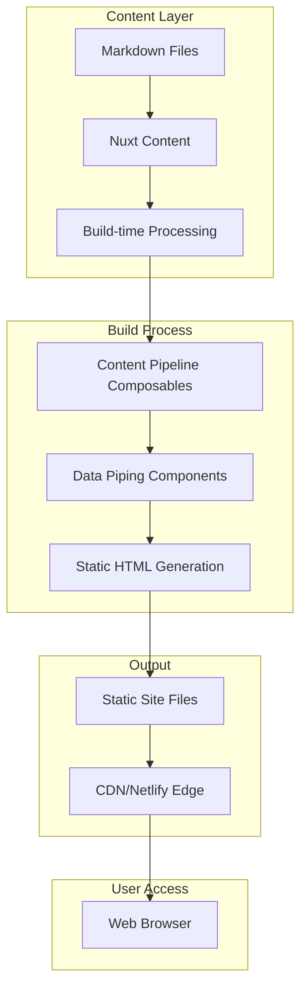
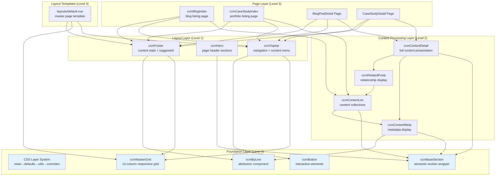
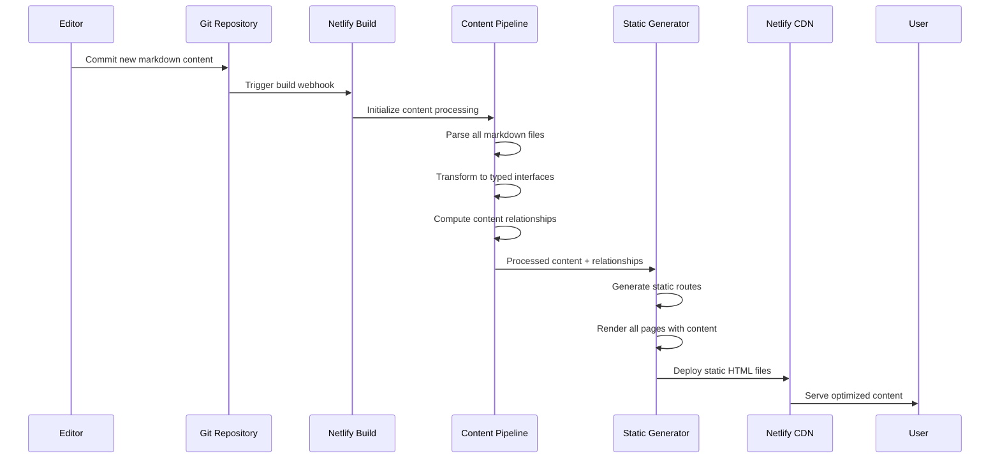
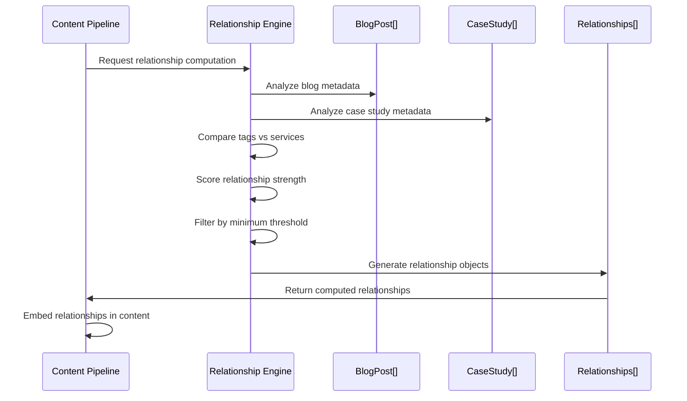
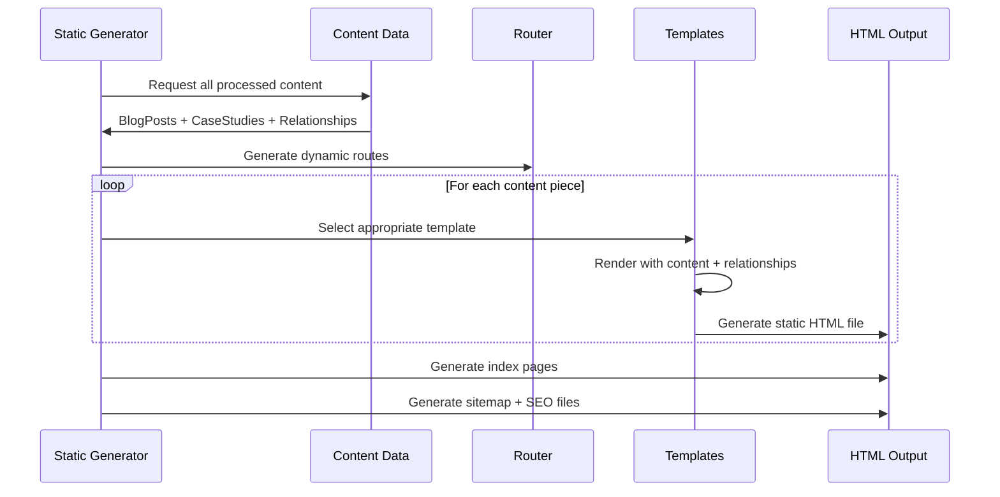
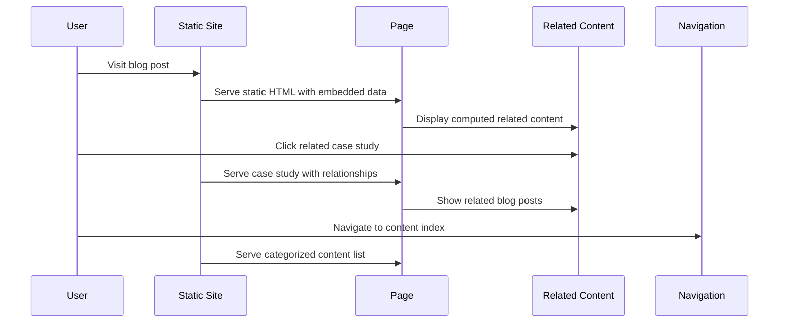
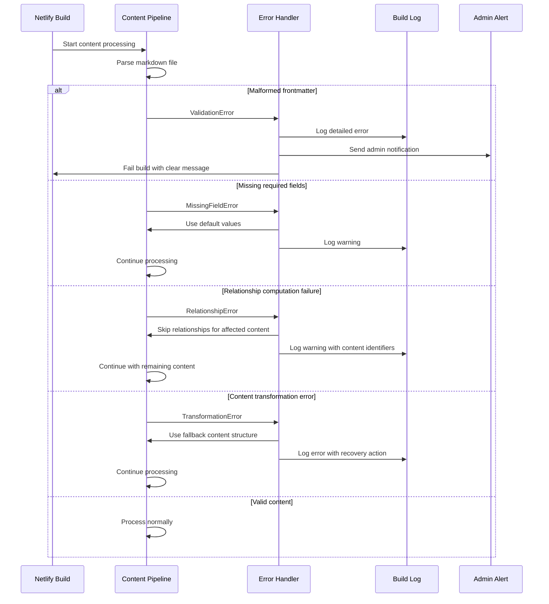

# CCM Website Fullstack Architecture Document

## Introduction

This document outlines the complete fullstack architecture for **CCM Website**, including backend systems, frontend implementation, and their integration. It serves as the single source of truth for AI-driven development, ensuring consistency across the entire technology stack for the content skeleton and data piping system enhancement.

This unified approach combines what would traditionally be separate backend and frontend architecture documents, streamlining the development process for this Nuxt 3-based static site generation project where content management and presentation concerns are tightly integrated.

### Starter Template or Existing Project

**Analysis**: Brownfield project based on Nuxt 3 template with custom enhancements.

**Current Foundation**: The project is built on a Nuxt 3 starter template but has been significantly customized with:
- Custom CSS layer architecture (reset, defaults, utils, overrides)
- Component-based architecture with ccm prefix naming convention
- Nuxt Content integration for file-based CMS
- Vue 3 Composition API patterns
- Server-side rendering configuration (SSR enabled) → **Changing to SSG**

**Architectural Constraints from Existing Codebase**:
- Must preserve existing ccm component naming and CSS class structures
- Must integrate with current CSS layer methodology
- Must work with existing Vue 3 Composition API patterns
- Must maintain compatibility with Nuxt Content file structure

**Enhancement Approach**: The PRD defines this as a "Brownfield Enhancement" to add content skeleton and data piping capabilities while preserving all existing architectural decisions and component structures.

### Change Log

| Date | Version | Description | Author |
|------|---------|-------------|---------|
| 2025-01-02 | v1.0 | Initial fullstack architecture document creation | Winston (Architect) |

## High Level Architecture

### Technical Summary

The CCM Website employs a **Static Site Generation (SSG) architecture** built on Nuxt 3, transitioning from the current server-side rendering configuration to a fully pre-rendered static site. This architecture leverages **build-time content processing** where all Nuxt Content markdown files are transformed into static HTML during the `nuxt generate` process, with content relationships and metadata pre-computed and embedded directly in the generated markup.

The frontend utilizes **Vue 3 Composition API** with a sophisticated CSS layer system (reset→defaults→utils→overrides) and component-based architecture using ccm naming conventions. The backend processing occurs entirely at build time through Nuxt Content's static generation capabilities, eliminating runtime API calls and creating a deployment-ready static site optimized for CDN delivery.

Key integration occurs through **content piping components** that bridge raw Nuxt Content data with structured HTML output, enabling complex blog posts (15+ metadata fields), case studies, and content relationships to be processed into semantic static markup. The architecture prioritizes content-first design where editorial workflows drive technical implementation, supporting the transition from research communication to digital publication platform.

### Platform and Infrastructure Choice

**Platform:** Netlify + Nuxt 3 SSG
**Key Services:** Git-based deployment, build optimization, CDN edge network, form handling
**Deployment Host and Regions:** Global CDN with automatic SSL

**Platform Selection Rationale**: Netlify chosen for content-heavy static sites with Git-based workflows, excellent Nuxt 3 support, automatic builds on content changes, and strong academic/research organization user base.

### Repository Structure

**Structure:** Monorepo with clear content/code separation
**Monorepo Tool:** Not required (simple Nuxt 3 project structure sufficient)
**Package Organization:** Single package with organized directories for content pipeline

### High Level Architecture Diagram



### Architectural Patterns

- **Jamstack Architecture:** Static site generation with build-time content processing - _Rationale:_ Optimal performance and SEO for content-heavy academic/research website
- **Content-First Design:** Editorial workflows drive technical architecture - _Rationale:_ Content complexity (15+ metadata fields) requires architecture that serves editorial needs first
- **Component-Based UI:** Reusable ccm-prefixed Vue components with CSS layers - _Rationale:_ Maintains existing design system while enabling content piping functionality
- **Build-Time Data Processing:** All content queries and relationships resolved during generation - _Rationale:_ Eliminates runtime complexity and ensures perfect SEO/performance
- **Progressive Enhancement:** Static HTML foundation with optional JavaScript enhancements - _Rationale:_ Ensures content accessibility and fast loading across all devices and networks

## Tech Stack

### Technology Stack Table

| Category | Technology | Version | Purpose | Rationale |
|----------|------------|---------|---------|-----------|
| **Frontend Language** | TypeScript | ^5.0.0 | Type-safe development across Vue components and composables | Existing project uses TS, essential for content pipeline type safety |
| **Frontend Framework** | Nuxt 3 | ^3.16.2 | Vue-based SSG framework with content processing | Already implemented, provides SSG capabilities needed for content piping |
| **UI Component Library** | Native Vue + CSS Layers | N/A | Custom components with existing ccm design system | Preserve existing CSS layer architecture and ccm component patterns |
| **State Management** | Vue Composition API | ^3.5.13 | Component state with composables for content processing | Lightweight approach suitable for static generation, existing pattern |
| **Backend Language** | TypeScript | ^5.0.0 | Build-time content processing and type definitions | Shared types between content pipeline and components |
| **Backend Framework** | Nuxt Content | ^3.5.1 | File-based CMS with markdown processing | Existing implementation, perfect for content piping requirements |
| **API Style** | Build-time Composables | N/A | Content queries during generation, no runtime APIs | Static generation eliminates need for runtime API layer |
| **Database** | File-based Markdown | N/A | Content stored as markdown with YAML frontmatter | Existing content structure with rich metadata (15+ fields) |
| **Cache** | Static Files + CDN | N/A | Generated HTML cached at edge locations | Static generation provides perfect caching by default |
| **File Storage** | Git Repository | N/A | Content versioning and editorial workflow | Existing approach, enables Git-based content management |
| **Authentication** | Not Required | N/A | Static site with no user accounts | Content publishing through Git, no user management needed |
| **Frontend Testing** | Vitest + Vue Test Utils | Latest | Unit testing for components and composables | Vue 3 ecosystem standard, integrated with Nuxt 3 |
| **Backend Testing** | Vitest | Latest | Testing content processing logic | Same tool for consistency, suitable for build-time logic testing |
| **E2E Testing** | Playwright | Latest | Full-site testing including content generation | Modern E2E tool with static site support |
| **Build Tool** | Vite | Latest | Development server and build optimization | Integrated with Nuxt 3, existing configuration |
| **Bundler** | Vite/Rollup | Latest | Production bundling and optimization | Nuxt 3 default, optimized for static generation |
| **IaC Tool** | Not Required | N/A | Static hosting via Netlify dashboard configuration | Simple static hosting, no infrastructure complexity |
| **CI/CD** | Netlify Build | N/A | Automated builds on Git commits with content processing | Integrated with hosting, optimized for static sites |
| **Monitoring** | Netlify Analytics | N/A | Traffic and performance monitoring | Built-in monitoring for static sites |
| **Logging** | Netlify Functions Logs | N/A | Build-time logging for content processing | Build process monitoring and debugging |
| **CSS Framework** | Custom CSS Layers | Existing | reset → defaults → utils → overrides methodology | Preserve existing sophisticated CSS architecture |

## Data Models

### BlogPost

**Purpose:** Represents blog post content with rich metadata for research communication and engagement tracking.

**Key Attributes:**
- `brow`: string - Category descriptor displayed above title for content classification
- `title`: string - Primary heading optimized for both SEO and academic credibility  
- `tagline`: string - Extended subtitle providing context and value proposition
- `date`: Date - Publication date for chronological organization and freshness indicators
- `author`: string - Attribution for academic credibility and expertise positioning
- `categories`: string[] - High-level content classification for navigation and filtering
- `tags`: string[] - Granular keywords for content discovery and relationship mapping
- `seo_tags`: string[] - SEO-optimized keywords for search engine optimization
- `excerpt`: string - Summary for index pages and social sharing previews
- `content`: string - Full markdown content processed into HTML during generation
- `slug`: string - URL-friendly identifier derived from filename for static routing
- `relationships`: ContentRelationship[] - Computed connections to case studies and related posts

#### TypeScript Interface
```typescript
interface BlogPost {
  brow: string;
  title: string;
  tagline: string;
  date: Date;
  author: string;
  categories: string[];
  tags: string[];
  seo_tags: string[];
  excerpt: string;
  content: string;
  slug: string;
  relationships: ContentRelationship[];
}
```

#### Relationships
- **Has Many** Case Studies (via tag matching and content analysis)
- **Belongs To** Author profile (for future expansion)
- **Related To** Other BlogPosts (via category and tag similarity)

### CaseStudy

**Purpose:** Represents client work and project case studies with structured narrative format for portfolio presentation.

**Key Attributes:**
- `title`: string - Project name and client context for clear identification
- `client`: string - Organization name for credibility and sector classification
- `challenge`: string - Problem description establishing project context and complexity
- `solution`: string - Approach and methodology demonstrating expertise and process
- `impact`: string - Results and outcomes showcasing value delivered
- `sector`: string - Industry classification for filtering and expertise demonstration
- `services`: string[] - Service categories provided for capability mapping
- `content`: string - Full narrative content processed from markdown
- `slug`: string - URL identifier for static routing and cross-references
- `featured_image`: string - Hero image path for visual portfolio presentation
- `gallery`: string[] - Additional images showcasing project work

#### TypeScript Interface
```typescript
interface CaseStudy {
  title: string;
  client: string;
  challenge: string;
  solution: string;
  impact: string;
  sector: string;
  services: string[];
  content: string;
  slug: string;
  featured_image?: string;
  gallery?: string[];
  relationships: ContentRelationship[];
}
```

#### Relationships
- **Related To** BlogPosts (via service and sector matching)
- **Belongs To** Client profile (for client portfolio grouping)
- **Has Many** Project deliverables (for future expansion)

### ContentRelationship

**Purpose:** Represents computed relationships between content pieces for cross-references and content discovery.

**Key Attributes:**
- `source_type`: 'blog' | 'case_study' - Type of content initiating the relationship
- `source_slug`: string - Identifier of the source content piece
- `target_type`: 'blog' | 'case_study' - Type of related content
- `target_slug`: string - Identifier of the related content piece
- `relationship_type`: RelationshipType - Nature of the connection
- `strength`: number - Computed relevance score (0-1) for relationship ranking
- `computed_reason`: string - Explanation of why items are related

#### TypeScript Interface
```typescript
type RelationshipType = 'same_category' | 'shared_tags' | 'same_client' | 'similar_services' | 'content_mention';

interface ContentRelationship {
  source_type: 'blog' | 'case_study';
  source_slug: string;
  target_type: 'blog' | 'case_study';
  target_slug: string;
  relationship_type: RelationshipType;
  strength: number;
  computed_reason: string;
}
```

#### Relationships
- **Connects** Any content type to any other content type
- **Computed During** Build process using content analysis algorithms
- **Used By** Related content components for cross-promotion

## API Specification

Since the tech stack uses **build-time composables** rather than runtime APIs, this section defines the content processing interfaces that operate during static generation.

### Build-Time Content Processing Interface

The content pipeline operates through composables that process markdown content during `nuxt generate`, transforming raw files into typed data structures for component consumption.

#### Content Pipeline Service Interfaces

**Service Boundary Definitions**: Each composable has clearly defined responsibilities with explicit input/output contracts and error handling.

```typescript
// ============================================================================
// PRIMARY CONTENT PROCESSING SERVICE
// ============================================================================
interface IContentPipelineService {
  // Core content transformation
  processAllContent(options?: ProcessingOptions): Promise<ContentProcessingResult>;
  
  // Content validation and sanitization
  validateContent(rawContent: RawContent[]): ValidationResult[];
  
  // Content transformation with error recovery
  transformContent(rawContent: RawContent[]): TransformationResult;
}

interface ProcessingOptions {
  skipRelationships?: boolean;
  validateOnly?: boolean;
  timeoutMs?: number;
}

interface ContentProcessingResult {
  success: boolean;
  content?: ProcessedContent;
  errors: ProcessingError[];
  warnings: ProcessingWarning[];
  metrics: ProcessingMetrics;
}

// ============================================================================
// RELATIONSHIP COMPUTATION SERVICE  
// ============================================================================
interface IContentRelationshipService {
  // Primary relationship computation with configurable algorithms
  computeRelationships(
    content: ProcessedContent, 
    options?: RelationshipOptions
  ): Promise<RelationshipResult>;
  
  // Relationship scoring with multiple algorithms
  scoreRelationship(
    source: BlogPost | CaseStudy, 
    target: BlogPost | CaseStudy,
    algorithm: RelationshipAlgorithm
  ): RelationshipScore;
  
  // Relationship validation and filtering
  filterRelationships(
    relationships: ContentRelationship[], 
    filters: RelationshipFilter[]
  ): ContentRelationship[];
}

interface RelationshipOptions {
  algorithms: RelationshipAlgorithm[];
  minStrength: number;
  maxRelationsPerContent: number;
  timeoutMs?: number;
}

interface RelationshipResult {
  success: boolean;
  relationships: ContentRelationship[];
  errors: RelationshipError[];
  algorithmMetrics: AlgorithmMetrics[];
}

type RelationshipAlgorithm = 'tag_similarity' | 'category_match' | 'content_analysis' | 'semantic_similarity';

// ============================================================================
// STATIC ROUTE GENERATION SERVICE
// ============================================================================
interface IStaticRouteService {
  // Generate all content-based routes
  generateContentRoutes(content: ProcessedContent): Promise<RouteGenerationResult>;
  
  // Generate index and listing pages  
  generateIndexRoutes(content: ProcessedContent): StaticRoute[];
  
  // Generate sitemap and SEO routes
  generateSEORoutes(content: ProcessedContent): SEORoute[];
}

interface RouteGenerationResult {
  success: boolean;
  routes: StaticRoute[];
  indexRoutes: StaticRoute[];
  seoRoutes: SEORoute[];
  errors: RouteError[];
}

// ============================================================================
// CONTENT METADATA SERVICE
// ============================================================================
interface IContentMetadataService {
  // Generate comprehensive build metadata
  generateMetadata(content: ProcessedContent): Promise<ContentMetadata>;
  
  // Content statistics and analytics
  generateContentStats(content: ProcessedContent): ContentStats;
  
  // Build performance metrics
  generateBuildMetrics(processingResults: ContentProcessingResult[]): BuildMetrics;
}

// ============================================================================
// SHARED DATA STRUCTURES
// ============================================================================
interface ProcessedContent {
  blogPosts: BlogPost[];
  caseStudies: CaseStudy[];
  relationships: ContentRelationship[];
  metadata: ContentMetadata;
  processingTimestamp: Date;
}

interface StaticRoute {
  path: string;
  component: string;
  props: Record<string, any>;
  metadata: RouteMetadata;
}

interface RouteMetadata {
  title: string;
  description?: string;
  lastModified: Date;
  priority: number;
}

interface SEORoute extends StaticRoute {
  sitemap: boolean;
  robots: 'index' | 'noindex';
  canonicalUrl?: string;
}

interface ContentMetadata {
  totalPosts: number;
  totalCaseStudies: number;
  categories: string[];
  tags: string[];
  authors: string[];
  lastUpdated: Date;
  buildTimestamp: Date;
  buildVersion: string;
  contentHash: string;
}

interface ProcessingMetrics {
  totalProcessingTime: number;
  contentTransformTime: number;
  relationshipComputeTime: number;
  routeGenerationTime: number;
  memoryUsage: number;
}

// ============================================================================
// ERROR HANDLING INTERFACES
// ============================================================================
interface ProcessingError {
  type: 'critical' | 'content' | 'transformation';
  source: string;
  message: string;
  recoveryAction: string;
  timestamp: Date;
}

interface RelationshipError {
  type: 'algorithm_failure' | 'timeout' | 'data_integrity';
  algorithm?: RelationshipAlgorithm;
  sourceContent: string;
  targetContent?: string;
  message: string;
}

interface RouteError {
  type: 'generation_failure' | 'duplicate_route' | 'invalid_props';
  route: string;
  message: string;
  resolution: string;
}
```

#### Service Implementation Examples

```typescript
// ============================================================================
// CONTENT PIPELINE SERVICE IMPLEMENTATION
// ============================================================================
export const useContentPipeline = (): IContentPipelineService => {
  const processAllContent = async (options: ProcessingOptions = {}): Promise<ContentProcessingResult> => {
    const startTime = Date.now();
    const errors: ProcessingError[] = [];
    const warnings: ProcessingWarning[] = [];
    
    try {
      // Step 1: Load raw content with timeout protection
      const timeoutMs = options.timeoutMs || 30000;
      const contentPromise = Promise.race([
        Promise.all([
          queryContent('blog').find(),
          queryContent('case-studies').find()
        ]),
        new Promise((_, reject) => 
          setTimeout(() => reject(new Error('Content loading timeout')), timeoutMs)
        )
      ]);
      
      const [blogPosts, caseStudies] = await contentPromise as any[];
      
      // Step 2: Validate content structure
      const validationResults = validateContent([...blogPosts, ...caseStudies]);
      validationResults.forEach(result => {
        if (result.severity === 'error') errors.push(result);
        if (result.severity === 'warning') warnings.push(result);
      });
      
      // Step 3: Transform to typed interfaces with error recovery
      const transformationResult = transformContent([...blogPosts, ...caseStudies]);
      errors.push(...transformationResult.errors);
      warnings.push(...transformationResult.warnings);
      
      // Step 4: Compute relationships (unless skipped)
      let relationships: ContentRelationship[] = [];
      if (!options.skipRelationships) {
        const relationshipService = useContentRelationships();
        const relationshipResult = await relationshipService.computeRelationships({
          blogPosts: transformationResult.processedBlogs,
          caseStudies: transformationResult.processedCases,
          relationships: [],
          metadata: {} as ContentMetadata,
          processingTimestamp: new Date()
        }, {
          algorithms: ['tag_similarity', 'category_match'],
          minStrength: 0.1,
          maxRelationsPerContent: 5
        });
        
        if (relationshipResult.success) {
          relationships = relationshipResult.relationships;
        } else {
          errors.push(...relationshipResult.errors.map(e => ({
            type: 'content' as const,
            source: 'relationship_computation',
            message: e.message,
            recoveryAction: 'Continue without relationships',
            timestamp: new Date()
          })));
        }
      }
      
      // Step 5: Generate metadata
      const metadataService = useContentMetadata();
      const metadata = await metadataService.generateMetadata({
        blogPosts: transformationResult.processedBlogs,
        caseStudies: transformationResult.processedCases,
        relationships,
        metadata: {} as ContentMetadata,
        processingTimestamp: new Date()
      });
      
      const endTime = Date.now();
      const metrics: ProcessingMetrics = {
        totalProcessingTime: endTime - startTime,
        contentTransformTime: transformationResult.transformTime,
        relationshipComputeTime: relationships.length > 0 ? 1000 : 0, // Placeholder
        routeGenerationTime: 0,
        memoryUsage: process.memoryUsage().heapUsed
      };
      
      return {
        success: errors.filter(e => e.type === 'critical').length === 0,
        content: {
          blogPosts: transformationResult.processedBlogs,
          caseStudies: transformationResult.processedCases,
          relationships,
          metadata,
          processingTimestamp: new Date()
        },
        errors,
        warnings,
        metrics
      };
      
    } catch (error) {
      errors.push({
        type: 'critical',
        source: 'content_pipeline',
        message: error instanceof Error ? error.message : 'Unknown error',
        recoveryAction: 'Check content structure and try again',
        timestamp: new Date()
      });
      
      return {
        success: false,
        errors,
        warnings,
        metrics: {
          totalProcessingTime: Date.now() - startTime,
          contentTransformTime: 0,
          relationshipComputeTime: 0,
          routeGenerationTime: 0,
          memoryUsage: process.memoryUsage().heapUsed
        }
      };
    }
  };
  
  const validateContent = (rawContent: RawContent[]): ValidationResult[] => {
    // Implementation for content validation
    return rawContent.map(content => validateSingleContent(content)).flat();
  };
  
  const transformContent = (rawContent: RawContent[]): TransformationResult => {
    // Implementation for content transformation with error recovery
    const startTime = Date.now();
    const processedBlogs: BlogPost[] = [];
    const processedCases: CaseStudy[] = [];
    const errors: ProcessingError[] = [];
    const warnings: ProcessingWarning[] = [];
    
    rawContent.forEach(content => {
      try {
        if (content._path?.includes('/blog/')) {
          processedBlogs.push(transformToBlogPost(content));
        } else if (content._path?.includes('/case-studies/')) {
          processedCases.push(transformToCaseStudy(content));
        }
      } catch (error) {
        errors.push({
          type: 'transformation',
          source: content._path || 'unknown',
          message: error instanceof Error ? error.message : 'Transformation failed',
          recoveryAction: 'Use fallback content structure',
          timestamp: new Date()
        });
      }
    });
    
    return {
      processedBlogs,
      processedCases,
      errors,
      warnings,
      transformTime: Date.now() - startTime
    };
  };
  
  return { processAllContent, validateContent, transformContent };
};

// ============================================================================
// RELATIONSHIP SERVICE IMPLEMENTATION  
// ============================================================================
export const useContentRelationships = (): IContentRelationshipService => {
  const computeRelationships = async (
    content: ProcessedContent,
    options: RelationshipOptions = {
      algorithms: ['tag_similarity'],
      minStrength: 0.1,
      maxRelationsPerContent: 3
    }
  ): Promise<RelationshipResult> => {
    const startTime = Date.now();
    const errors: RelationshipError[] = [];
    const relationships: ContentRelationship[] = [];
    
    try {
      // Apply each algorithm with timeout protection
      for (const algorithm of options.algorithms) {
        const algorithmPromise = applyRelationshipAlgorithm(content, algorithm, options);
        const timeoutPromise = new Promise<ContentRelationship[]>((_, reject) =>
          setTimeout(() => reject(new Error(`${algorithm} timeout`)), options.timeoutMs || 10000)
        );
        
        try {
          const algorithmResults = await Promise.race([algorithmPromise, timeoutPromise]);
          relationships.push(...algorithmResults);
        } catch (error) {
          errors.push({
            type: 'timeout',
            algorithm,
            sourceContent: 'multiple',
            message: `Algorithm ${algorithm} timed out`,
          });
        }
      }
      
      // Filter and sort relationships
      const filteredRelationships = filterRelationships(relationships, [
        { type: 'min_strength', value: options.minStrength },
        { type: 'max_per_content', value: options.maxRelationsPerContent }
      ]);
      
      return {
        success: true,
        relationships: filteredRelationships,
        errors,
        algorithmMetrics: options.algorithms.map(alg => ({
          algorithm: alg,
          processingTime: Date.now() - startTime,
          relationshipsGenerated: relationships.filter(r => r.relationship_type.includes(alg.split('_')[0])).length
        }))
      };
      
    } catch (error) {
      return {
        success: false,
        relationships: [],
        errors: [{
          type: 'algorithm_failure',
          sourceContent: 'pipeline',
          message: error instanceof Error ? error.message : 'Unknown relationship error'
        }],
        algorithmMetrics: []
      };
    }
  };
  
  const scoreRelationship = (
    source: BlogPost | CaseStudy,
    target: BlogPost | CaseStudy,
    algorithm: RelationshipAlgorithm
  ): RelationshipScore => {
    // Implementation for relationship scoring based on algorithm
    switch (algorithm) {
      case 'tag_similarity':
        return calculateTagSimilarity(source, target);
      case 'category_match':
        return calculateCategoryMatch(source, target);
      default:
        return { score: 0, confidence: 0, reason: 'Unknown algorithm' };
    }
  };
  
  const filterRelationships = (
    relationships: ContentRelationship[],
    filters: RelationshipFilter[]
  ): ContentRelationship[] => {
    return relationships.filter(relationship => {
      return filters.every(filter => applyRelationshipFilter(relationship, filter));
    });
  };
  
  return { computeRelationships, scoreRelationship, filterRelationships };
};

// ============================================================================
// STATIC ROUTE SERVICE IMPLEMENTATION
// ============================================================================
export const useStaticRoutes = (): IStaticRouteService => {
  const generateContentRoutes = async (content: ProcessedContent): Promise<RouteGenerationResult> => {
    const routes: StaticRoute[] = [];
    const errors: RouteError[] = [];
    
    try {
      // Generate blog post routes
      content.blogPosts.forEach(post => {
        try {
          routes.push({
            path: `/blog/${post.slug}`,
            component: 'BlogPostDetail',
            props: { 
              post, 
              relationships: getRelatedContent(post, content) 
            },
            metadata: {
              title: post.title,
              description: post.excerpt,
              lastModified: post.date,
              priority: 0.8
            }
          });
        } catch (error) {
          errors.push({
            type: 'generation_failure',
            route: `/blog/${post.slug}`,
            message: error instanceof Error ? error.message : 'Route generation failed',
            resolution: 'Check post data structure'
          });
        }
      });
      
      // Generate case study routes
      content.caseStudies.forEach(study => {
        try {
          routes.push({
            path: `/case-studies/${study.slug}`,
            component: 'CaseStudyDetail',
            props: { 
              study, 
              relationships: getRelatedContent(study, content) 
            },
            metadata: {
              title: study.title,
              description: study.challenge,
              lastModified: new Date(), // Case studies don't have dates
              priority: 0.9
            }
          });
        } catch (error) {
          errors.push({
            type: 'generation_failure',
            route: `/case-studies/${study.slug}`,
            message: error instanceof Error ? error.message : 'Route generation failed',
            resolution: 'Check case study data structure'
          });
        }
      });
      
      const indexRoutes = generateIndexRoutes(content);
      const seoRoutes = generateSEORoutes(content);
      
      return {
        success: errors.length === 0,
        routes,
        indexRoutes,
        seoRoutes,
        errors
      };
      
    } catch (error) {
      return {
        success: false,
        routes: [],
        indexRoutes: [],
        seoRoutes: [],
        errors: [{
          type: 'generation_failure',
          route: 'multiple',
          message: error instanceof Error ? error.message : 'Route generation failed',
          resolution: 'Check content processing pipeline'
        }]
      };
    }
  };
  
  const generateIndexRoutes = (content: ProcessedContent): StaticRoute[] => {
    return [
      {
        path: '/blog',
        component: 'BlogIndex',
        props: { posts: content.blogPosts },
        metadata: {
          title: 'Blog',
          description: 'Latest insights and research communication',
          lastModified: new Date(),
          priority: 0.9
        }
      },
      {
        path: '/case-studies',
        component: 'CaseStudyIndex', 
        props: { studies: content.caseStudies },
        metadata: {
          title: 'Case Studies',
          description: 'Our portfolio of successful projects',
          lastModified: new Date(),
          priority: 0.9
        }
      }
    ];
  };
  
  const generateSEORoutes = (content: ProcessedContent): SEORoute[] => {
    // Generate sitemap and SEO-specific routes
    const allRoutes = [
      ...content.blogPosts.map(post => ({
        path: `/blog/${post.slug}`,
        component: 'BlogPostDetail',
        props: { post },
        metadata: {
          title: post.title,
          description: post.excerpt,
          lastModified: post.date,
          priority: 0.8
        },
        sitemap: true,
        robots: 'index' as const,
        canonicalUrl: `https://ccm-website.com/blog/${post.slug}`
      }))
    ];
    
    return allRoutes;
  };
  
  return { generateContentRoutes, generateIndexRoutes, generateSEORoutes };
};
```

#### Build-Time Data Transformation

```typescript
// Transform markdown content to typed interfaces
const transformToBlogPost = (rawPost: any): BlogPost => ({
  brow: rawPost.brow || '',
  title: rawPost.title,
  tagline: rawPost.tagline || '',
  date: new Date(rawPost.date),
  author: rawPost.author || 'CCM Team',
  categories: rawPost.categories || [],
  tags: rawPost.tags || [],
  seo_tags: rawPost.seo_tags || [],
  excerpt: rawPost.excerpt || '',
  content: rawPost.body?.html || '',
  slug: rawPost._path?.replace('/blog/', '') || '',
  relationships: [] // Populated during relationship computation
});

const transformToCaseStudy = (rawStudy: any): CaseStudy => ({
  title: rawStudy.title,
  client: extractClientFromTitle(rawStudy.title),
  challenge: rawStudy.challenge || '',
  solution: rawStudy.solution || '',
  impact: rawStudy.impact || '',
  sector: rawStudy.sector || 'General',
  services: rawStudy.services || [],
  content: rawStudy.body?.html || '',
  slug: rawStudy._path?.replace('/case-studies/', '') || '',
  featured_image: rawStudy.featured_image,
  gallery: rawStudy.gallery || [],
  relationships: []
});
```

## Components

Based on the architectural patterns, tech stack, and data models, the major logical components across the fullstack system:

### ccmContentPipeline

**Responsibility:** Core content processing service that transforms markdown files into typed data structures during build time, handling all content queries, relationship computation, and metadata generation.

**Key Interfaces:**
- `processAllContent()`: Main entry point for content transformation during static generation
- `computeContentRelationships()`: Algorithm-based relationship detection between blog posts and case studies
- `generateContentMetadata()`: Build-time statistics and indexing information

**Dependencies:** Nuxt Content API, file system access, TypeScript interfaces

**Technology Stack:** Nuxt Content composables, Promise-based async processing, TypeScript for type safety

### ccmDataPiping

**Responsibility:** Component layer that receives processed content from pipeline and renders semantic HTML structure during static generation, serving as bridge between content processing and presentation.

**Key Interfaces:**
- `ccmContentMeta`: Renders rich metadata (brow, title, tagline, author, date) with semantic markup
- `ccmContentList`: Displays content collections with filtering and relationship highlighting
- `ccmContentDetail`: Full content presentation with embedded related content sections

**Dependencies:** ccmContentPipeline output, existing ccm component patterns, CSS layer system

**Technology Stack:** Vue 3 SFC components with Composition API, ccm naming conventions, CSS layer integration

### ccmRelationshipEngine

**Responsibility:** Intelligent content relationship detection and scoring system that analyzes content similarity, shared metadata, and cross-references to create meaningful content connections.

**Key Interfaces:**
- `computeTagSimilarity()`: Algorithm for matching blog posts to case studies via shared concepts
- `scoreRelationshipStrength()`: Weighted scoring system for relationship relevance ranking
- `generateCrossReferences()`: Bidirectional relationship mapping for content discovery

**Dependencies:** Data models (BlogPost, CaseStudy), content analysis algorithms, metadata processing

**Technology Stack:** TypeScript algorithms, build-time processing, content analysis utilities

### ccmStaticGenerator

**Responsibility:** Route generation and HTML creation system that produces all static pages, index routes, and content-specific URLs based on processed content structure.

**Key Interfaces:**
- `generateContentRoutes()`: Creates static routes for all blog posts and case studies
- `generateIndexPages()`: Produces listing pages with filtering and categorization
- `generateSitemapData()`: SEO-optimized site structure for search engines

**Dependencies:** Processed content data, Nuxt routing system, static generation pipeline

**Technology Stack:** Nuxt generate hooks, static route configuration, SEO optimization utilities

### ccmLayoutSystem

**Responsibility:** Existing layout and presentation layer enhanced with content piping capabilities, maintaining CSS layer architecture while adding content-specific rendering logic.

**Key Interfaces:**
- `ccmMasterGrid`: Enhanced grid system supporting dynamic content layouts
- `ccmTopbar`: Navigation integration with content-based menu generation
- `ccmFooter`: Content statistics and relationship-based suggested content

**Dependencies:** Existing ccm components, CSS layer system, processed content for dynamic elements

**Technology Stack:** Existing Vue 3 components, CSS layers (reset→defaults→utils→overrides), responsive grid system

### Frontend Component Hierarchy

**Component Dependency Tree and Reusability Patterns:**



**Component Reusability Matrix:**

| Component Level | Reusability | Dependencies | Usage Pattern |
|-----------------|-------------|---------------|---------------|
| **Foundation (Level 0)** | Highest | None | Used throughout system |
| • ccmMasterGrid | Universal | CSS layers | All layouts requiring grid structure |
| • ccmBaseSection | Universal | CSS layers | All semantic content sections |
| • ccmButton | Universal | CSS layers | All interactive elements |
| • ccmByLine | High | CSS layers | Author attribution across content types |
| **Layout (Level 1)** | High | Foundation | Page structure components |
| • ccmTopbar | Universal | Grid, Button | All pages requiring navigation |
| • ccmHero | High | BaseSection | Landing and feature pages |
| • ccmFooter | Universal | Grid, ByLine | All pages requiring footer |
| **Content (Level 2)** | Medium | Foundation + Layout | Content-specific components |
| • ccmContentMeta | High | BaseSection, ByLine | All content types needing metadata |
| • ccmContentList | High | BaseSection, Meta | All listing and index pages |
| • ccmContentDetail | Medium | BaseSection, Meta, Related | Individual content pages |
| • ccmRelatedPosts | Medium | ContentList | Content pages with relationships |
| **Page (Level 3)** | Low | All layers | Specific page implementations |
| • ccmBlogIndex | Single-use | List, Layout | Blog listing page only |
| • ccmCaseStudyIndex | Single-use | List, Layout | Case study portfolio only |
| • Page Templates | Single-use | Detail, Layout | Individual content pages |

**Shared Component Guidelines:**

**Foundation Components (Level 0):**
- **Never modify directly** - changes affect entire system
- **CSS layer integration required** - must work with existing layer system
- **Accessibility built-in** - semantic HTML and ARIA support
- **No content awareness** - purely presentational/structural

**Layout Components (Level 1):**
- **Content-aware** - can display dynamic navigation/footer content
- **Responsive by default** - work across all breakpoints
- **Can compose foundation** - build using Level 0 components
- **Theme consistent** - follow established visual patterns

**Content Components (Level 2):**
- **Type-aware** - understand BlogPost vs CaseStudy differences
- **Relationship-aware** - can display content connections
- **Build-time optimized** - receive processed data from composables
- **SEO optimized** - generate semantic markup for search engines

**Page Components (Level 3):**
- **Single responsibility** - one page type per component
- **Compose all layers** - integrate layout, content, and foundation
- **Route-specific** - tied to specific URL patterns
- **Static generation friendly** - work with Nuxt generate process

**Component Development Principles:**
1. **Dependency Direction**: Always depend on lower levels, never higher
2. **Prop Drilling Avoidance**: Use composables for complex data needs
3. **CSS Inheritance**: Leverage CSS layer system rather than component-specific styles
4. **TypeScript Contracts**: All props and events strictly typed
5. **Testing Isolation**: Each level testable independently

## Core Workflows

Key system workflows illustrating content processing, static generation, and user interactions:

### Content Publication Workflow



### Content Relationship Computation



### Static Page Generation Flow



### User Content Discovery Journey



### Build-Time Error Handling



### Content Processing Resilience Strategy

**Error Recovery Hierarchy:**
1. **Critical Errors** (Fail Build): Malformed project structure, missing required dependencies
2. **Content Errors** (Skip & Continue): Individual content piece processing failures
3. **Relationship Errors** (Degrade Gracefully): Relationship computation failures don't block content
4. **Validation Warnings** (Log & Continue): Missing optional metadata, formatting issues

**Specific Failure Scenarios:**

**Relationship Computation Failures:**
- **Scenario**: Algorithm fails to compute relationships for specific content pair
- **Recovery**: Skip affected relationships, continue processing remaining content
- **Logging**: Log content identifiers and relationship type that failed
- **User Impact**: Content still publishes, just without some related content suggestions

**Content Transformation Errors:**
- **Scenario**: Markdown processing fails for individual post/case study
- **Recovery**: Use fallback content structure with title/date only
- **Logging**: Log transformation error with specific content file path
- **User Impact**: Content publishes with minimal metadata instead of full rich data

**Build Performance Degradation:**
- **Scenario**: Relationship algorithms timeout with large content volumes
- **Recovery**: Implement timeout limits, fallback to simpler relationship scoring
- **Logging**: Performance metrics and timeout warnings
- **User Impact**: Reduced relationship accuracy but site still builds

**Content Validation Pipeline:**
```typescript
// Enhanced error handling in content pipeline
interface ContentProcessingResult {
  success: boolean;
  content?: ProcessedContent;
  errors: ContentError[];
  warnings: ContentWarning[];
}

interface ContentError {
  type: 'critical' | 'content' | 'relationship' | 'validation';
  source: string;
  message: string;
  recoveryAction: string;
}
```

## Unified Project Structure

Monorepo structure accommodating content processing, static generation, and existing ccm component architecture:

```plaintext
ccm-website/
├── .github/                    # CI/CD workflows
│   └── workflows/
│       ├── build-deploy.yml    # Netlify build integration
│       └── content-preview.yml # PR preview builds
├── components/                 # ccm Component Library
│   ├── ccmContentMeta.vue      # Metadata display component
│   ├── ccmContentList.vue      # Content listing with relationships
│   ├── ccmContentDetail.vue    # Full content presentation
│   ├── ccmRelatedPosts.vue     # Related content recommendations
│   ├── ccmBlogIndex.vue        # Blog listing page component
│   ├── ccmCaseStudyIndex.vue   # Case study portfolio component
│   ├── ccmMasterGrid.vue       # Existing responsive grid system
│   ├── ccmTopbar.vue           # Enhanced navigation with content
│   ├── ccmHero.vue             # Existing hero component
│   ├── ccmFooter.vue           # Enhanced footer with content stats
│   ├── ccmBaseSection.vue      # Existing section wrapper
│   ├── ccmButton.vue           # Existing button component
│   └── ccmByLine.vue           # Existing byline component
├── composables/                # Content Processing Logic
│   ├── useContentPipeline.ts   # Main content processing composable
│   ├── useContentRelationships.ts # Relationship computation logic
│   ├── useStaticRoutes.ts      # Route generation for static content
│   ├── useContentMetadata.ts   # Build-time metadata processing
│   └── useContentTransforms.ts # Markdown to TypeScript transformations
├── content/                    # Nuxt Content Files
│   ├── index.md                # Homepage content
│   ├── about.md                # About page content
│   ├── blog/                   # Blog posts with rich frontmatter
│   │   ├── 2025-08-27-stanford-research-center-400-percent-engagement.md
│   │   ├── 2025-08-27-modular-content-blueprint.md
│   │   ├── 2025-08-27-interactive-stakeholder-dashboards.md
│   │   ├── 2025-08-27-executive-approval-accelerator.md
│   │   └── 2025-01-27-mobile-first-research-reports.md
│   └── case-studies/           # Case study portfolio pieces
│       ├── bfna-federalism-in-crisis.md
│       ├── bfna-how-to-fix-democracy.md
│       ├── bfna-people-led-innovation.md
│       ├── govlab-institutional-website.md
│       ├── harvard-tech-spotlight.md
│       └── 360giving-design-system.md
├── layouts/                    # Page Layout Templates
│   └── default.vue             # Enhanced with content integration
├── pages/                      # Static Route Definitions
│   ├── index.vue               # Homepage with content highlights
│   ├── about.vue               # About page
│   ├── blog/                   # Blog section pages
│   │   ├── index.vue           # Blog listing page
│   │   └── [...slug].vue       # Dynamic blog post pages
│   └── case-studies/           # Portfolio section pages
│       ├── index.vue           # Case study listing page
│       └── [...slug].vue       # Dynamic case study pages
├── public/                     # Static Assets
│   ├── css/                    # CSS Layer Architecture (preserved)
│   │   ├── base/               # Reset, fonts, typography, layout
│   │   ├── vars/               # CSS custom properties
│   │   ├── utils/              # Utility classes
│   │   └── styles.css          # Main CSS entry point
│   ├── images/                 # Image assets for content
│   └── favicon.ico             # Site favicon
├── types/                      # TypeScript Definitions
│   ├── content.ts              # BlogPost, CaseStudy, ContentRelationship
│   ├── pipeline.ts             # Content processing interfaces
│   └── components.ts           # Component prop definitions
├── utils/                      # Utility Functions
│   ├── content-transforms.ts   # Content processing utilities
│   ├── relationship-scoring.ts # Relationship algorithms
│   └── seo-optimization.ts     # SEO metadata generation
├── tests/                      # Test Suites
│   ├── components/             # Component unit tests
│   ├── composables/            # Content processing logic tests
│   ├── e2e/                    # Full-site integration tests
│   └── fixtures/               # Test content and data
├── docs/                       # Project Documentation
│   ├── prd.md                  # Product requirements document
│   ├── architecture.md         # This fullstack architecture document
│   ├── implementation-plan.md  # Development planning document
│   └── README.md               # Project setup and development guide
├── .env.example                # Environment variables template
├── .gitignore                  # Git ignore patterns
├── eslint.config.mjs           # ESLint configuration (existing)
├── nuxt.config.ts              # Nuxt configuration with SSG settings
├── package.json                # Dependencies and scripts
├── tsconfig.json               # TypeScript configuration
└── README.md                   # Main project documentation
```

## Development Workflow

### Local Development Setup

#### Prerequisites
```bash
# Node.js 18+ and npm
node --version  # Should be 18+
npm --version   # Should be 8+

# Git for content management
git --version
```

#### Initial Setup
```bash
# Clone repository and install dependencies
git clone <repository-url> ccm-website
cd ccm-website
npm install

# Copy environment template
cp .env.example .env.local

# Generate TypeScript types
npm run build
```

#### Development Commands
```bash
# Start development server with hot reload
npm run dev

# Build static site for production
npm run generate

# Preview generated static site locally
npm run preview

# Run all tests
npm run test

# Run component tests only
npm run test:components

# Run E2E tests
npm run test:e2e

# Lint and format code
npm run lint
npm run lint:fix
```

### Environment Configuration

#### Required Environment Variables
```bash
# Development (.env.local)
NUXT_PUBLIC_SITE_URL=http://localhost:3000
NUXT_PUBLIC_SITE_NAME="CCM Website"

# Production (.env)
NUXT_PUBLIC_SITE_URL=https://your-domain.com
NUXT_PUBLIC_SITE_NAME="CCM Website"
NUXT_PUBLIC_ANALYTICS_ID=your-analytics-id

# Build Configuration
NODE_ENV=production
NITRO_PRESET=netlify
```

## Deployment Architecture

### Deployment Strategy

**Frontend Deployment:**
- **Platform:** Netlify with Git-based continuous deployment
- **Build Command:** `npm run generate`
- **Output Directory:** `dist/`
- **CDN/Edge:** Netlify Edge Network with global distribution and automatic SSL

**Backend Deployment:**
- **Platform:** Build-time processing only (no runtime backend)
- **Build Command:** Content processing during `nuxt generate`
- **Deployment Method:** Static files deployed to Netlify CDN

### CI/CD Pipeline
```yaml
# .github/workflows/build-deploy.yml
name: Build and Deploy
on:
  push:
    branches: [main]
  pull_request:
    branches: [main]

jobs:
  build:
    runs-on: ubuntu-latest
    steps:
      - uses: actions/checkout@v4
      - uses: actions/setup-node@v4
        with:
          node-version: '18'
          cache: 'npm'
      
      - name: Install dependencies
        run: npm ci
      
      - name: Run tests
        run: npm run test
      
      - name: Generate static site
        run: npm run generate
        env:
          NODE_ENV: production
      
      - name: Deploy to Netlify
        if: github.ref == 'refs/heads/main'
        uses: netlify/actions/build@master
        with:
          publish-dir: dist
        env:
          NETLIFY_AUTH_TOKEN: ${{ secrets.NETLIFY_AUTH_TOKEN }}
          NETLIFY_SITE_ID: ${{ secrets.NETLIFY_SITE_ID }}
```

### Environments
| Environment | Frontend URL | Backend URL | Purpose |
|------------|--------------|-------------|---------|
| Development | http://localhost:3000 | Build-time only | Local development with hot reload |
| Staging | https://staging--ccm-website.netlify.app | Build-time only | Pre-production testing and content preview |
| Production | https://ccm-website.com | Build-time only | Live static site |

## Security and Performance

### Security Requirements

**Frontend Security:**
- CSP Headers: `default-src 'self'; style-src 'self' 'unsafe-inline' fonts.googleapis.com; font-src fonts.gstatic.com`
- XSS Prevention: Static generation eliminates XSS vectors, content sanitization during markdown processing
- Secure Storage: No client-side data storage required, all content embedded in static HTML

**Backend Security:**
- Input Validation: Markdown content validation during build process with schema enforcement
- Rate Limiting: Not applicable (static site with no runtime APIs)
- CORS Policy: Not required (no API endpoints, static file serving only)

**Authentication Security:**
- Token Storage: Not required (no user authentication system)
- Session Management: Not applicable (static site)
- Password Policy: Not required (content management through Git)

### Performance Optimization

**Frontend Performance:**
- Bundle Size Target: < 100KB JavaScript, < 50KB CSS (excluding content)
- Loading Strategy: Static HTML with progressive enhancement, critical CSS inlined
- Caching Strategy: Aggressive CDN caching (1 year static assets, 1 hour HTML)

**Backend Performance:**
- Response Time Target: < 100ms (CDN edge response time)
- Database Optimization: Not applicable (file-based content)
- Caching Strategy: Perfect caching through static generation, build-time optimization

## Testing Strategy

### Testing Pyramid
```
E2E Tests (Playwright)
/              \
Integration Tests (Component + Content)
/                              \
Unit Tests (Components)    Unit Tests (Composables)
```

### Test Organization

**Frontend Tests:**
```
tests/
├── components/
│   ├── ccmContentMeta.test.ts      # Metadata display testing
│   ├── ccmContentList.test.ts      # Content listing with relationships
│   ├── ccmRelatedPosts.test.ts     # Related content algorithms
│   └── ccmMasterGrid.test.ts       # Layout system integration
├── composables/
│   ├── useContentPipeline.test.ts  # Content processing logic
│   ├── useContentRelationships.test.ts # Relationship computation
│   └── useStaticRoutes.test.ts     # Route generation logic
└── fixtures/
    ├── sample-blog-posts.json      # Test content data
    └── sample-case-studies.json    # Test portfolio data
```

**Backend Tests:**
```
tests/
├── build-process/
│   ├── content-parsing.test.ts     # Markdown processing validation
│   ├── relationship-engine.test.ts # Content relationship accuracy
│   └── static-generation.test.ts   # Build output verification
├── content-validation/
│   ├── frontmatter-schema.test.ts  # Metadata validation rules
│   └── markdown-processing.test.ts # Content transformation testing
└── performance/
    ├── build-time.test.ts          # Build performance benchmarks
    └── relationship-algorithms.test.ts # Algorithm efficiency testing
```

**E2E Tests:**
```
tests/e2e/
├── content-discovery.spec.ts       # User content navigation flows
├── related-content.spec.ts         # Cross-content relationship testing
├── seo-validation.spec.ts          # SEO metadata and structure
└── performance.spec.ts             # Core Web Vitals and loading times
```

### Test Examples

**Frontend Component Test:**
```typescript
// tests/components/ccmContentMeta.test.ts
import { mount } from '@vue/test-utils'
import ccmContentMeta from '~/components/ccmContentMeta.vue'
import type { BlogPost } from '~/types/content'

describe('ccmContentMeta', () => {
  const mockBlogPost: BlogPost = {
    brow: 'Research Communication',
    title: 'Test Blog Post',
    tagline: 'Sample tagline for testing',
    date: new Date('2025-01-01'),
    author: 'Test Author',
    categories: ['Digital Transformation'],
    tags: ['research', 'communication'],
    seo_tags: ['test-seo'],
    excerpt: 'Test excerpt',
    content: '<p>Test content</p>',
    slug: 'test-blog-post',
    relationships: []
  }

  it('renders blog post metadata correctly', () => {
    const wrapper = mount(ccmContentMeta, {
      props: { content: mockBlogPost }
    })
    
    expect(wrapper.find('[data-testid="brow"]').text()).toBe('Research Communication')
    expect(wrapper.find('[data-testid="title"]').text()).toBe('Test Blog Post')
    expect(wrapper.find('[data-testid="author"]').text()).toBe('Test Author')
  })
  
  it('formats date correctly', () => {
    const wrapper = mount(ccmContentMeta, {
      props: { content: mockBlogPost }
    })
    
    expect(wrapper.find('[data-testid="date"]').text()).toContain('Jan 1, 2025')
  })
})
```

**Backend API Test:**
```typescript
// tests/composables/useContentPipeline.test.ts
import { describe, it, expect, vi } from 'vitest'
import { useContentPipeline } from '~/composables/useContentPipeline'

describe('useContentPipeline', () => {
  it('processes blog posts correctly', async () => {
    const { processContent } = useContentPipeline()
    
    // Mock Nuxt Content query
    vi.mock('@nuxt/content', () => ({
      queryContent: vi.fn().mockReturnValue({
        find: vi.fn().mockResolvedValue([
          {
            title: 'Test Post',
            date: '2025-01-01',
            tags: ['test'],
            body: { html: '<p>Test content</p>' }
          }
        ])
      })
    }))
    
    const result = await processContent()
    
    expect(result.blogPosts).toHaveLength(1)
    expect(result.blogPosts[0].title).toBe('Test Post')
    expect(result.blogPosts[0].date).toBeInstanceOf(Date)
  })
  
  it('computes relationships correctly', async () => {
    // Test relationship computation logic
    const { processContent } = useContentPipeline()
    const result = await processContent()
    
    expect(result.relationships).toBeDefined()
    expect(result.relationships.length).toBeGreaterThanOrEqual(0)
  })
})
```

**E2E Test:**
```typescript
// tests/e2e/content-discovery.spec.ts
import { test, expect } from '@playwright/test'

test.describe('Content Discovery Flow', () => {
  test('user can navigate from blog post to related case study', async ({ page }) => {
    await page.goto('/blog/stanford-research-center-400-percent-engagement')
    
    // Verify blog post loads
    await expect(page.locator('[data-testid="blog-title"]')).toBeVisible()
    
    // Find and click related case study
    const relatedContent = page.locator('[data-testid="related-content"]')
    await expect(relatedContent).toBeVisible()
    
    const relatedCaseStudy = relatedContent.locator('a').first()
    await relatedCaseStudy.click()
    
    // Verify case study loads
    await expect(page.locator('[data-testid="case-study-title"]')).toBeVisible()
    
    // Verify back-relationship exists
    const backRelated = page.locator('[data-testid="related-content"]')
    await expect(backRelated).toBeVisible()
  })
  
  test('content index pages load all content', async ({ page }) => {
    await page.goto('/blog')
    
    // Verify blog index loads
    await expect(page.locator('[data-testid="blog-list"]')).toBeVisible()
    
    // Count blog posts
    const blogPosts = page.locator('[data-testid="blog-item"]')
    await expect(blogPosts).toHaveCount.greaterThan(0)
    
    // Test case study index
    await page.goto('/case-studies')
    await expect(page.locator('[data-testid="case-study-list"]')).toBeVisible()
  })
})
```

## Code Documentation Standards

### JSDoc Documentation Requirements

**All composables, components, and utility functions must include comprehensive JSDoc comments following these standards:**

```typescript
/**
 * Content pipeline service that transforms markdown files into typed data structures
 * during static generation. Handles content processing, relationship computation,
 * and metadata generation with comprehensive error recovery.
 * 
 * @example
 * ```typescript
 * const { processAllContent } = useContentPipeline();
 * const result = await processAllContent({ 
 *   skipRelationships: false,
 *   timeoutMs: 30000 
 * });
 * if (result.success) {
 *   console.log(`Processed ${result.content.blogPosts.length} blog posts`);
 * }
 * ```
 * 
 * @since 1.0.0
 * @see {@link IContentPipelineService} for interface definition
 */
export const useContentPipeline = (): IContentPipelineService => {
  
  /**
   * Processes all content during build with comprehensive error handling
   * and performance monitoring. Supports timeout protection and graceful
   * degradation for relationship computation failures.
   * 
   * @param options - Processing configuration options
   * @param options.skipRelationships - Skip relationship computation to improve build time
   * @param options.validateOnly - Only validate content structure without processing
   * @param options.timeoutMs - Maximum processing time before timeout (default: 30000)
   * 
   * @returns Promise resolving to processing result with content, errors, and metrics
   * 
   * @throws {ContentProcessingError} When critical errors prevent content processing
   * 
   * @example
   * ```typescript
   * // Process all content with relationship computation
   * const result = await processAllContent();
   * 
   * // Skip relationships for faster builds
   * const fastResult = await processAllContent({ skipRelationships: true });
   * 
   * // Validation-only mode
   * const validation = await processAllContent({ validateOnly: true });
   * ```
   */
  const processAllContent = async (options: ProcessingOptions = {}): Promise<ContentProcessingResult> => {
    // Implementation with inline comments for complex logic
    const startTime = Date.now();
    
    // Step 1: Load content with timeout protection to prevent build hangs
    const timeoutMs = options.timeoutMs || 30000;
    // ... rest of implementation
  };
```

### Vue Component Documentation Standards

**All Vue components must include comprehensive documentation:**

```vue
<template>
  <!-- Component template with semantic HTML -->
  <article class="content-meta" :class="{ 'is-featured': content.featured }">
    <header class="content-meta__header">
      <!-- Brow text provides content categorization context -->
      <span class="content-meta__brow" data-testid="brow">{{ content.brow }}</span>
      
      <!-- Main title with SEO optimization -->
      <h1 class="content-meta__title" data-testid="title">{{ content.title }}</h1>
    </header>
  </article>
</template>

<script setup lang="ts">
/**
 * Content metadata display component that renders rich content information
 * including categorization, titles, authors, and publication dates with
 * semantic HTML structure optimized for SEO and accessibility.
 * 
 * Used across all content types (blog posts, case studies) to provide
 * consistent metadata presentation with responsive design and screen
 * reader support.
 * 
 * @component ccmContentMeta
 * @example
 * ```vue
 * <ccmContentMeta 
 *   :content="blogPost" 
 *   :show-author="true"
 *   @author-click="handleAuthorClick" 
 * />
 * ```
 * 
 * @since 1.0.0
 * @see {@link BlogPost} for content data structure
 * @see {@link CaseStudy} for case study data structure
 */

import type { BlogPost, CaseStudy } from '~/types/content';

interface Props {
  /** Content item to display metadata for */
  content: BlogPost | CaseStudy;
  
  /** Whether to show author information (default: true) */
  showAuthor?: boolean;
  
  /** Whether to show publication date (default: true) */
  showDate?: boolean;
  
  /** Additional CSS classes for styling customization */
  class?: string;
}

interface Emits {
  /** Emitted when author name is clicked for author page navigation */
  (e: 'author-click', author: string): void;
  
  /** Emitted when content title is clicked for content navigation */
  (e: 'title-click', content: BlogPost | CaseStudy): void;
}

/**
 * Component props with default values and validation
 */
const props = withDefaults(defineProps<Props>(), {
  showAuthor: true,
  showDate: true
});

/**
 * Component event emissions for parent component communication
 */
const emit = defineEmits<Emits>();

/**
 * Computed property to determine if content is a blog post
 * Used for conditional rendering of blog-specific metadata
 */
const isBlogPost = computed(() => 'date' in props.content);

/**
 * Handles author click events with proper event emission
 * Provides navigation support for author profile pages
 */
const handleAuthorClick = () => {
  if ('author' in props.content) {
    emit('author-click', props.content.author);
  }
};
</script>
```

### Inline Comment Standards

**Complex logic must include explanatory comments:**

```typescript
// ============================================================================
// RELATIONSHIP COMPUTATION ALGORITHM
// ============================================================================

/**
 * Computes content relationships using multiple algorithms with timeout protection.
 * Each algorithm runs independently to prevent single algorithm failures from
 * blocking the entire relationship computation process.
 */
const computeRelationships = async (content: ProcessedContent, options: RelationshipOptions) => {
  const relationships: ContentRelationship[] = [];
  
  // Process each algorithm with independent timeout handling
  for (const algorithm of options.algorithms) {
    try {
      // Race condition: algorithm execution vs timeout
      // This prevents any single algorithm from blocking the build process
      const algorithmPromise = applyRelationshipAlgorithm(content, algorithm, options);
      const timeoutPromise = new Promise<ContentRelationship[]>((_, reject) =>
        setTimeout(() => reject(new Error(`${algorithm} timeout`)), options.timeoutMs || 10000)
      );
      
      const algorithmResults = await Promise.race([algorithmPromise, timeoutPromise]);
      relationships.push(...algorithmResults);
      
    } catch (error) {
      // Log algorithm failure but continue processing other algorithms
      // This ensures partial relationship computation rather than complete failure
      console.warn(`Algorithm ${algorithm} failed:`, error);
      // Continue with next algorithm...
    }
  }
  
  // Filter relationships by strength threshold
  // Lower threshold = more relationships but potentially less relevant
  // Higher threshold = fewer but more precise relationships
  return relationships.filter(rel => rel.strength >= options.minStrength);
};
```

### TypeScript Interface Documentation

**All interfaces must include comprehensive property documentation:**

```typescript
/**
 * Represents a blog post with rich metadata for research communication
 * and engagement tracking. Includes SEO optimization fields and content
 * relationship data for cross-content discovery.
 * 
 * @interface BlogPost
 * @since 1.0.0
 * @see {@link CaseStudy} for portfolio content structure
 */
interface BlogPost {
  /** 
   * Category descriptor displayed above title for content classification.
   * Provides immediate context about content type (e.g., "Research Communication")
   * 
   * @example "Research Communication Case Study"
   */
  brow: string;
  
  /** 
   * Primary heading optimized for both SEO and academic credibility.
   * Should be descriptive and include target keywords for search optimization.
   * 
   * @example "How Stanford Research Center Achieved 400% Engagement Through Personalized Reports"
   */
  title: string;
  
  /** 
   * Extended subtitle providing context and value proposition.
   * Appears below title to elaborate on the main content focus.
   * 
   * @example "Strategic technology implementation transforms research impact while maintaining academic integrity"
   */
  tagline: string;
  
  /** 
   * Publication date for chronological organization and freshness indicators.
   * Used for content sorting and "last updated" display to users.
   */
  date: Date;
  
  /** 
   * Computed relationships to other content pieces for cross-promotion.
   * Generated during build process using relationship algorithms.
   * Empty array if no relationships found or computation skipped.
   * 
   * @see {@link ContentRelationship} for relationship data structure
   */
  relationships: ContentRelationship[];
}
```

### Error Handling Documentation

**All error handling must be documented with recovery strategies:**

```typescript
try {
  const result = await processContent(content);
  return result;
  
} catch (error) {
  // Categorize error type for appropriate handling strategy
  if (error instanceof ValidationError) {
    // Content structure errors - log and use fallback structure
    // Recovery: Continue with minimal content data to prevent build failure
    console.warn(`Content validation failed for ${content.path}:`, error.message);
    return createFallbackContent(content);
    
  } else if (error instanceof TimeoutError) {
    // Processing timeout - likely content volume or algorithm complexity
    // Recovery: Skip complex processing and use basic content structure  
    console.error(`Content processing timeout for ${content.path}:`, error.message);
    return createBasicContent(content);
    
  } else {
    // Unknown error - log details and re-throw to prevent silent failures
    // This ensures critical errors are not hidden but logged for debugging
    console.error(`Unexpected content processing error:`, error);
    throw new ContentProcessingError(`Failed to process content: ${error.message}`, { cause: error });
  }
}
```

### Documentation Validation Rules

1. **Mandatory Documentation**: All public functions, components, and interfaces must have JSDoc
2. **Examples Required**: Complex functions must include usage examples
3. **Parameter Documentation**: All parameters must document type, purpose, and constraints  
4. **Return Documentation**: All return values must document structure and possible states
5. **Error Documentation**: All thrown errors must be documented with recovery strategies
6. **Since Tags**: All new code must include @since version tags
7. **See References**: Related code must be cross-referenced with @see tags
8. **Inline Comments**: Complex algorithms must include step-by-step explanations

### ESLint Documentation Rules

```javascript
// eslint.config.mjs additions for documentation enforcement
export default [
  {
    rules: {
      // Enforce JSDoc comments for all functions
      'jsdoc/require-jsdoc': ['error', {
        require: {
          FunctionDeclaration: true,
          MethodDefinition: true,
          ClassDeclaration: true,
          ArrowFunctionExpression: false,
          FunctionExpression: true
        }
      }],
      
      // Require parameter documentation
      'jsdoc/require-param': 'error',
      'jsdoc/require-param-description': 'error',
      'jsdoc/require-param-type': 'error',
      
      // Require return documentation
      'jsdoc/require-returns': 'error',
      'jsdoc/require-returns-description': 'error',
      'jsdoc/require-returns-type': 'error',
      
      // Enforce example documentation for complex functions
      'jsdoc/require-example': ['warn', {
        contexts: ['FunctionDeclaration', 'MethodDefinition']
      }]
    }
  }
];
```

## Monitoring and Observability

### Monitoring Stack
- **Frontend Monitoring:** Netlify Analytics with Core Web Vitals tracking
- **Backend Monitoring:** Build process monitoring through Netlify Build logs
- **Error Tracking:** Build-time error logging and alerting
- **Performance Monitoring:** Static site performance through CDN analytics

### Key Metrics

**Frontend Metrics:**
- Core Web Vitals
- JavaScript errors
- API response times
- User interactions

**Backend Metrics:**
- Request rate
- Error rate
- Response time
- Database query performance

### Debugging and Troubleshooting Tools

**Build-Time Content Analysis Tools:**

```typescript
// Debug utilities for content pipeline analysis
interface ContentDebugTools {
  // Relationship analysis and visualization
  analyzeRelationships(content: ProcessedContent): RelationshipAnalysis;
  
  // Content processing performance profiler
  profileBuildPerformance(metrics: ProcessingMetrics[]): PerformanceReport;
  
  // Content validation diagnostics
  diagnoseContentIssues(errors: ProcessingError[]): DiagnosticReport;
  
  // Build artifact inspection
  inspectBuildArtifacts(outputDir: string): ArtifactReport;
}

interface RelationshipAnalysis {
  totalRelationships: number;
  algorithmBreakdown: AlgorithmStats[];
  orphanedContent: ContentItem[];
  relationshipStrengthDistribution: StrengthBucket[];
  potentialMisses: MissedRelationship[];
}

interface PerformanceReport {
  bottlenecks: PerformanceBottleneck[];
  memoryUsageProfile: MemoryProfile[];
  algorithmEfficiency: AlgorithmEfficiency[];
  optimizationRecommendations: OptimizationTip[];
}

interface DiagnosticReport {
  errorCategories: ErrorCategory[];
  contentHealthScore: number;
  recoveryActions: RecoveryAction[];
  preventionSuggestions: PreventionTip[];
}
```

**Content Relationship Debugger:**

```bash
# CLI debugging commands for content analysis
npm run debug:relationships
# Outputs:
# - Relationship matrix visualization
# - Algorithm performance comparison  
# - Orphaned content identification
# - Relationship strength histogram

npm run debug:content-health
# Outputs:
# - Content validation summary
# - Missing metadata analysis
# - Content structure consistency check
# - Frontmatter schema validation

npm run debug:build-performance  
# Outputs:
# - Processing time breakdown by stage
# - Memory usage analysis
# - Algorithm timeout incidents
# - Bottleneck identification with recommendations
```

**Build Artifact Inspector:**

```typescript
// Post-build analysis tools
interface BuildArtifactInspector {
  // Analyze generated static files
  inspectGeneratedContent(): {
    totalPages: number;
    contentWithRelationships: number;
    relationshipCoverage: number;
    missingRelationships: string[];
  };
  
  // Validate route generation
  validateRouteGeneration(): {
    totalRoutes: number;
    brokenRoutes: string[];
    missingContent: string[];
    seoMetadataComplete: boolean;
  };
  
  // Performance analysis of generated assets
  analyzeAssetPerformance(): {
    bundleSizes: BundleSize[];
    criticalPathOptimization: CriticalPathReport;
    cacheabilityScore: number;
  };
}
```

**Development Debug Dashboard:**

```bash
# Local development debugging server
npm run debug:dashboard
# Serves debug interface at http://localhost:3001/debug

# Debug dashboard features:
# - Real-time relationship computation visualization
# - Content processing pipeline flow diagram
# - Error log streaming with filtering
# - Performance metrics charting
# - Build artifact browser
# - Content relationship graph explorer
```

**Debug Configuration:**

```typescript
// nuxt.config.ts debug enhancements
export default defineNuxtConfig({
  // ... existing config
  runtimeConfig: {
    public: {
      debugMode: process.env.NODE_ENV === 'development',
      debugRelationships: process.env.DEBUG_RELATIONSHIPS === 'true',
      debugPerformance: process.env.DEBUG_PERFORMANCE === 'true'
    }
  },
  
  // Debug-specific build hooks
  hooks: {
    'content:file:beforeParse': (file) => {
      if (process.env.DEBUG_CONTENT) {
        console.log(`Processing: ${file.path}`);
      }
    },
    
    'build:before': () => {
      if (process.env.DEBUG_BUILD) {
        console.log('Starting debug-enabled build...');
      }
    }
  }
});
```

**Error Diagnosis Tools:**

```typescript
// Enhanced error analysis for troubleshooting
interface ErrorDiagnostics {
  // Categorize and analyze build errors
  categorizeErrors(errors: ProcessingError[]): {
    criticalErrors: ProcessingError[];
    contentErrors: ProcessingError[];
    relationshipErrors: ProcessingError[];
    recoveredErrors: ProcessingError[];
    recommendations: TroubleshootingStep[];
  };
  
  // Content-specific error analysis
  analyzeContentErrors(contentPath: string): {
    validationIssues: ValidationIssue[];
    structureProblems: StructureProblem[];
    metadataInconsistencies: MetadataIssue[];
    fixSuggestions: FixSuggestion[];
  };
  
  // Relationship computation debugging
  debugRelationshipFailures(sourceContent: string, targetContent?: string): {
    algorithmResults: AlgorithmDebugResult[];
    dataIntegrityCheck: DataIntegrityResult;
    computationTrace: ComputationStep[];
    possibleFixes: RelationshipFix[];
  };
}
```

**Production Debugging (Netlify Integration):**

```typescript
// Netlify build plugin for enhanced debugging
// netlify.toml configuration
[build.environment]
  DEBUG_CONTENT_PROCESSING = "true"
  DEBUG_RELATIONSHIP_COMPUTATION = "true"

[plugins]
  package = "@ccm/netlify-debug-plugin"
  
  [plugins.inputs]
    # Generate debug artifacts during production builds
    generateDebugArtifacts = true
    
    # Store relationship analysis in build artifacts
    storeRelationshipAnalysis = true
    
    # Performance profiling in production builds
    enablePerformanceProfiling = true
```

**Debug Output Examples:**

```bash
# Example debug output for relationship analysis
🔍 Content Relationship Analysis
├── Total Relationships: 47
├── Algorithm Performance:
│   ├── tag_similarity: 32 relationships (avg: 0.3s)
│   ├── category_match: 15 relationships (avg: 0.1s)
│   └── content_analysis: 0 relationships (timeout: 3 failures)
├── Orphaned Content: 2 items
│   ├── blog/2025-08-27-executive-approval-accelerator.md
│   └── case-studies/harvard-tech-spotlight.md
└── Optimization Suggestions:
    ├── Increase tag_similarity timeout (3 near-timeouts detected)
    └── Review content_analysis algorithm (100% failure rate)

# Example debug output for build performance
⚡ Build Performance Analysis
├── Total Build Time: 45.2s
├── Bottlenecks:
│   ├── Relationship Computation: 23.1s (51%)
│   ├── Content Transformation: 8.7s (19%)
│   └── Route Generation: 4.2s (9%)
├── Memory Usage Peak: 245MB
└── Recommendations:
    ├── Enable relationship caching for incremental builds
    └── Consider relationship algorithm parallelization
```

**Troubleshooting Runbook:**

```markdown
# Content Processing Troubleshooting Guide

## Common Issues and Solutions

### Build Fails with Relationship Errors
1. Check content metadata consistency
2. Run `npm run debug:content-health`
3. Identify orphaned content with `npm run debug:relationships`
4. Adjust relationship algorithm timeouts if needed

### Slow Build Performance  
1. Run `npm run debug:build-performance`
2. Check relationship algorithm efficiency
3. Consider content volume impact
4. Enable incremental build caching

### Missing Content Relationships
1. Validate content metadata (tags, categories)
2. Check relationship strength thresholds
3. Review algorithm selection in pipeline configuration
4. Use relationship debugger to trace computation

### Content Validation Failures
1. Run content health diagnostic
2. Check frontmatter schema compliance
3. Validate markdown structure
4. Review error recovery configuration
```

## Accessibility Implementation [[FRONTEND ONLY]]

### Accessibility Standards

**WCAG 2.1 AA Compliance Target**: All components and content must meet WCAG 2.1 Level AA standards for accessibility, with specific enhancements for research and academic content presentation.

#### Semantic HTML Usage Requirements

**All content components must use semantic HTML5 elements:**

```vue
<template>
  <!-- Blog post semantic structure -->
  <article class="blog-post" role="main">
    <header class="blog-post__header">
      <!-- Content categorization with semantic hierarchy -->
      <p class="blog-post__category" aria-label="Content category">{{ content.brow }}</p>
      
      <!-- Main heading with proper heading hierarchy -->
      <h1 class="blog-post__title" id="main-title">{{ content.title }}</h1>
      
      <!-- Subtitle with semantic relationship -->
      <p class="blog-post__subtitle" aria-describedby="main-title">{{ content.tagline }}</p>
      
      <!-- Author and publication metadata -->
      <div class="blog-post__meta" role="contentinfo">
        <address class="blog-post__author">
          <span aria-label="Author">By {{ content.author }}</span>
        </address>
        <time class="blog-post__date" :datetime="content.date.toISOString()">
          {{ formatDate(content.date) }}
        </time>
      </div>
    </header>
    
    <!-- Main content with proper content structure -->
    <div class="blog-post__content" v-html="content.content" />
    
    <!-- Related content with semantic navigation -->
    <aside class="blog-post__related" aria-labelledby="related-heading">
      <h2 id="related-heading">Related Content</h2>
      <nav aria-label="Related articles">
        <ul role="list">
          <li v-for="related in content.relationships" :key="related.target_slug">
            <a :href="`/${related.target_type}/${related.target_slug}`" 
               :aria-describedby="`related-${related.target_slug}`">
              {{ getRelatedTitle(related) }}
            </a>
          </li>
        </ul>
      </nav>
    </aside>
  </article>
</template>
```

**Semantic HTML Guidelines:**
- **Document Structure**: `<main>`, `<article>`, `<section>`, `<aside>`, `<nav>`, `<header>`, `<footer>`
- **Content Hierarchy**: Proper heading sequence (h1 → h2 → h3) without skipping levels
- **Lists**: Use `<ul>`, `<ol>`, `<li>` for content collections with `role="list"` when styling removes semantics
- **Forms**: `<fieldset>`, `<legend>`, `<label>` with proper associations (future expansion)
- **Interactive Elements**: `<button>` for actions, `<a>` for navigation with clear distinctions

#### ARIA Implementation Guidelines

**Required ARIA Attributes for Content Components:**

```typescript
// ARIA attribute patterns for content components
interface AccessibilityProps {
  // Labeling and description
  'aria-label'?: string;           // Accessible name when text is insufficient
  'aria-labelledby'?: string;      // Reference to labeling element
  'aria-describedby'?: string;     // Reference to description element
  
  // State and properties
  'aria-expanded'?: boolean;       // For collapsible content sections
  'aria-current'?: 'page' | 'step' | 'location'; // For navigation state
  'aria-hidden'?: boolean;         // For decorative elements
  
  // Relationships
  'aria-owns'?: string;            // For content ownership relationships
  'aria-controls'?: string;        // For interactive element control
  
  // Content type identification
  'role'?: string;                 // Semantic role when HTML semantics insufficient
}
```

**ARIA Implementation Examples:**

```vue
<template>
  <!-- Content list with proper ARIA labels -->
  <section class="content-list" aria-labelledby="content-heading">
    <h2 id="content-heading">Latest Research Articles</h2>
    
    <!-- Search and filter controls -->
    <div class="content-filters" role="search" aria-label="Filter articles">
      <input 
        type="search" 
        id="content-search"
        aria-label="Search articles by title or content"
        aria-describedby="search-help"
        v-model="searchTerm" 
      />
      <p id="search-help" class="sr-only">
        Enter keywords to filter articles. Results update automatically.
      </p>
    </div>
    
    <!-- Results with dynamic ARIA labels -->
    <div 
      class="content-results" 
      aria-live="polite" 
      aria-label="Search results"
      :aria-busy="loading.toString()"
    >
      <p class="results-count" aria-live="polite">
        {{ filteredContent.length }} articles found
      </p>
      
      <!-- Content grid with navigation structure -->
      <div class="content-grid" role="grid" aria-label="Article grid">
        <article 
          v-for="(article, index) in filteredContent" 
          :key="article.slug"
          class="content-item"
          role="gridcell"
          :aria-rowindex="Math.floor(index / 3) + 1"
          :aria-colindex="(index % 3) + 1"
        >
          <!-- Content item structure -->
        </article>
      </div>
    </div>
  </section>
</template>
```

#### Keyboard Navigation Requirements

**All interactive elements must support keyboard navigation:**

```typescript
// Keyboard navigation composable for content components
export const useKeyboardNavigation = () => {
  /**
   * Handles keyboard navigation for content lists
   * Supports arrow keys, Enter, Space, Home, End navigation
   */
  const handleKeyboardNavigation = (event: KeyboardEvent, context: 'list' | 'grid' | 'menu') => {
    const { key, target } = event;
    const currentElement = target as HTMLElement;
    
    switch (key) {
      case 'ArrowDown':
        event.preventDefault();
        moveToNext(currentElement, context);
        break;
        
      case 'ArrowUp':
        event.preventDefault();
        moveToPrevious(currentElement, context);
        break;
        
      case 'ArrowRight':
        if (context === 'grid') {
          event.preventDefault();
          moveToNextColumn(currentElement);
        }
        break;
        
      case 'ArrowLeft':
        if (context === 'grid') {
          event.preventDefault();
          moveToPreviousColumn(currentElement);
        }
        break;
        
      case 'Home':
        event.preventDefault();
        moveToFirst(currentElement, context);
        break;
        
      case 'End':
        event.preventDefault();
        moveToLast(currentElement, context);
        break;
        
      case 'Enter':
      case ' ':
        event.preventDefault();
        activateElement(currentElement);
        break;
    }
  };
  
  return { handleKeyboardNavigation };
};
```

**Keyboard Navigation Patterns:**
- **Content Lists**: Arrow keys for navigation, Enter/Space for activation
- **Content Grid**: Arrow keys in all directions, logical tab order
- **Navigation Menu**: Arrow keys, Home/End for first/last items
- **Content Sections**: Tab to focus, Enter to expand/collapse
- **Skip Links**: Skip to main content, skip navigation implemented

#### Focus Management Approach

**Focus management for static site with progressive enhancement:**

```vue
<template>
  <div class="content-detail">
    <!-- Skip link for keyboard users -->
    <a href="#main-content" class="skip-link">Skip to main content</a>
    
    <!-- Focus management for content sections -->
    <main id="main-content" tabindex="-1" ref="mainContent">
      <article class="content-article">
        <!-- Content with focus restoration -->
        <section 
          v-for="section in contentSections" 
          :key="section.id"
          :class="{ 'is-focused': focusedSection === section.id }"
          @focusin="handleSectionFocus(section.id)"
        >
          <!-- Section content -->
        </section>
      </article>
    </main>
    
    <!-- Focus trap for modal content (if needed) -->
    <div 
      v-if="showModal" 
      class="modal-overlay" 
      @keydown.esc="closeModal"
      ref="modalContainer"
    >
      <!-- Modal content with focus trap -->
    </div>
  </div>
</template>

<script setup lang="ts">
import { ref, onMounted, nextTick } from 'vue';

/**
 * Focus management for content navigation
 * Ensures keyboard users can navigate content effectively
 */
const mainContent = ref<HTMLElement>();
const modalContainer = ref<HTMLElement>();
const focusedSection = ref<string | null>(null);

/**
 * Sets focus to main content area
 * Used for skip link functionality and page navigation
 */
const focusMainContent = async () => {
  await nextTick();
  mainContent.value?.focus();
};

/**
 * Manages focus when content sections change
 * Announces changes to screen readers
 */
const handleSectionFocus = (sectionId: string) => {
  focusedSection.value = sectionId;
  // Announce section change to screen readers
  announceToScreenReader(`Focused on ${getSectionTitle(sectionId)} section`);
};

/**
 * Announces text to screen readers
 * Uses aria-live region for dynamic content changes
 */
const announceToScreenReader = (text: string) => {
  const announcement = document.createElement('div');
  announcement.setAttribute('aria-live', 'polite');
  announcement.setAttribute('aria-atomic', 'true');
  announcement.className = 'sr-only';
  announcement.textContent = text;
  
  document.body.appendChild(announcement);
  setTimeout(() => document.body.removeChild(announcement), 1000);
};
</script>
```

#### Screen Reader Compatibility

**Screen reader optimization for research content:**

```vue
<template>
  <!-- Enhanced content structure for screen readers -->
  <article class="research-article" role="main">
    <!-- Article metadata optimized for screen readers -->
    <header class="article-header">
      <div class="article-meta" aria-label="Article information">
        <!-- Content type announcement -->
        <span class="sr-only">Article type: {{ content.brow }}</span>
        <p class="article-category" aria-hidden="true">{{ content.brow }}</p>
        
        <!-- Title with proper heading hierarchy -->
        <h1 class="article-title">{{ content.title }}</h1>
        
        <!-- Subtitle with relationship to title -->
        <p class="article-subtitle" role="doc-subtitle">{{ content.tagline }}</p>
        
        <!-- Author and date with structured data -->
        <div class="article-byline">
          <span class="sr-only">Published by</span>
          <address class="article-author">{{ content.author }}</address>
          <span class="sr-only">on</span>
          <time 
            class="article-date" 
            :datetime="content.date.toISOString()"
            :aria-label="formatDateForScreenReader(content.date)"
          >
            {{ formatDate(content.date) }}
          </time>
        </div>
      </div>
    </header>
    
    <!-- Content with enhanced structure -->
    <div class="article-content">
      <!-- Reading time estimate for screen reader users -->
      <div class="reading-info" aria-label="Reading information">
        <p class="sr-only">
          Estimated reading time: {{ estimateReadingTime(content.content) }} minutes
        </p>
      </div>
      
      <!-- Main content with enhanced markup -->
      <div 
        class="content-body" 
        v-html="enhanceContentForAccessibility(content.content)"
      />
    </div>
    
    <!-- Related content with clear relationships -->
    <aside class="related-content" aria-labelledby="related-heading">
      <h2 id="related-heading">Related Research</h2>
      <p class="sr-only">
        The following {{ content.relationships.length }} articles are related to this content:
      </p>
      
      <nav aria-label="Related articles navigation">
        <ul role="list">
          <li v-for="(related, index) in content.relationships" :key="related.target_slug">
            <article class="related-item">
              <h3>
                <a 
                  :href="`/${related.target_type}/${related.target_slug}`"
                  :aria-describedby="`related-desc-${index}`"
                >
                  {{ getRelatedTitle(related) }}
                </a>
              </h3>
              <p :id="`related-desc-${index}`" class="related-reason">
                {{ related.computed_reason }}
              </p>
            </article>
          </li>
        </ul>
      </nav>
    </aside>
  </article>
</template>

<script setup lang="ts">
/**
 * Enhances content HTML for better screen reader experience
 * Adds ARIA labels, reading structure, and navigation aids
 */
const enhanceContentForAccessibility = (htmlContent: string): string => {
  // Add heading navigation structure
  let enhanced = htmlContent.replace(
    /<h([2-6])>(.*?)<\/h[2-6]>/g, 
    '<h$1 role="heading" aria-level="$1">$2</h$1>'
  );
  
  // Enhance lists with proper roles
  enhanced = enhanced.replace(
    /<ul>/g, 
    '<ul role="list">'
  );
  
  // Add alt text suggestions for images without alt
  enhanced = enhanced.replace(
    /]*?)src="([^"]*?)"(?![^>]*alt=)/g,
    '/g,
    '<table role="table" aria-label="Data table">'
  );
  
  return enhanced;
};

/**
 * Formats date specifically for screen reader announcement
 * Provides verbose date format for clarity
 */
const formatDateForScreenReader = (date: Date): string => {
  return date.toLocaleDateString('en-US', {
    weekday: 'long',
    year: 'numeric',
    month: 'long',
    day: 'numeric'
  });
};

/**
 * Estimates reading time for screen reader users
 * Helps users understand content length
 */
const estimateReadingTime = (content: string): number => {
  const wordsPerMinute = 200; // Average reading speed
  const wordCount = content.replace(/<[^>]*>/g, '').split(/\s+/).length;
  return Math.ceil(wordCount / wordsPerMinute);
};
</script>

<style scoped>
/* Screen reader only text */
.sr-only {
  position: absolute;
  width: 1px;
  height: 1px;
  padding: 0;
  margin: -1px;
  overflow: hidden;
  clip: rect(0, 0, 0, 0);
  white-space: nowrap;
  border: 0;
}

/* Skip link styling */
.skip-link {
  position: absolute;
  top: -40px;
  left: 6px;
  background: #000;
  color: #fff;
  padding: 8px;
  text-decoration: none;
  z-index: 1000;
}

.skip-link:focus {
  top: 6px;
}

/* High contrast mode support */
@media (prefers-contrast: high) {
  .article-title {
    border: 2px solid;
  }
  
  .content-item:focus {
    outline: 3px solid;
  }
}

/* Reduced motion support */
@media (prefers-reduced-motion: reduce) {
  * {
    animation-duration: 0.01ms !important;
    animation-iteration-count: 1 !important;
    transition-duration: 0.01ms !important;
  }
}
</style>
```

### Accessibility Testing

#### Accessibility Testing Tools Integration

**Required accessibility testing tools:**

```json
// package.json accessibility testing dependencies
{
  "devDependencies": {
    "@axe-core/playwright": "^4.8.0",
    "axe-core": "^4.7.0",
    "@storybook/addon-a11y": "^7.0.0",
    "pa11y": "^6.2.3",
    "pa11y-ci": "^3.0.1",
    "lighthouse": "^10.0.0"
  }
}
```

**Automated accessibility testing integration:**

```typescript
// tests/accessibility/axe-tests.spec.ts
import { test, expect } from '@playwright/test';
import AxeBuilder from '@axe-core/playwright';

test.describe('Accessibility Tests', () => {
  test('homepage meets WCAG 2.1 AA standards', async ({ page }) => {
    await page.goto('/');
    
    const accessibilityScanResults = await new AxeBuilder({ page })
      .withTags(['wcag2a', 'wcag2aa', 'wcag21aa'])
      .analyze();
    
    expect(accessibilityScanResults.violations).toEqual([]);
  });
  
  test('blog post page meets accessibility standards', async ({ page }) => {
    await page.goto('/blog/stanford-research-center-400-percent-engagement');
    
    const accessibilityScanResults = await new AxeBuilder({ page })
      .withTags(['wcag2a', 'wcag2aa', 'wcag21aa'])
      .exclude('#non-critical-decorative-element')
      .analyze();
    
    expect(accessibilityScanResults.violations).toEqual([]);
  });
  
  test('content list keyboard navigation', async ({ page }) => {
    await page.goto('/blog');
    
    // Test keyboard navigation
    await page.keyboard.press('Tab'); // Focus first item
    await page.keyboard.press('ArrowDown'); // Navigate to second item
    await page.keyboard.press('Enter'); // Activate item
    
    // Verify navigation worked
    await expect(page).toHaveURL(/\/blog\/.+/);
    
    // Run accessibility check on navigated page
    const accessibilityScanResults = await new AxeBuilder({ page })
      .withTags(['wcag2a', 'wcag2aa'])
      .analyze();
    
    expect(accessibilityScanResults.violations).toEqual([]);
  });
});
```

#### Testing Process Integration

**CI/CD Pipeline Integration:**

```yaml
# .github/workflows/accessibility.yml
name: Accessibility Tests
on:
  push:
    branches: [main, develop]
  pull_request:
    branches: [main]

jobs:
  accessibility:
    runs-on: ubuntu-latest
    steps:
      - uses: actions/checkout@v4
      
      - name: Setup Node.js
        uses: actions/setup-node@v4
        with:
          node-version: '18'
          cache: 'npm'
      
      - name: Install dependencies
        run: npm ci
      
      - name: Build site
        run: npm run generate
      
      - name: Run pa11y accessibility tests
        run: npx pa11y-ci --sitemap http://localhost:3000/sitemap.xml
        
      - name: Run Playwright accessibility tests
        run: npm run test:a11y
        
      - name: Generate accessibility report
        run: npm run lighthouse:a11y
        
      - name: Upload accessibility report
        uses: actions/upload-artifact@v3
        if: always()
        with:
          name: accessibility-report
          path: |
            accessibility-report/
            lighthouse-report/
```

**Development Workflow Integration:**

```json
// package.json scripts for accessibility testing
{
  "scripts": {
    "test:a11y": "playwright test tests/accessibility/",
    "test:a11y:watch": "playwright test tests/accessibility/ --ui",
    "a11y:audit": "pa11y-ci --sitemap http://localhost:3000/sitemap.xml",
    "a11y:report": "lighthouse --chrome-flags='--headless' --output=html --output-path=./accessibility-report/lighthouse.html http://localhost:3000",
    "dev:a11y": "concurrently 'npm run dev' 'npm run a11y:audit -- --threshold 80'"
  }
}
```

#### WCAG 2.1 AA Compliance Targets

**Compliance Requirements:**
- **Level A**: All Level A success criteria must be met
- **Level AA**: All Level AA success criteria must be met (target level)
- **Enhanced**: Selected Level AAA criteria for research content

**Specific WCAG 2.1 AA Requirements:**
1. **Perceivable**:
   - Text alternatives for images
   - Captions for videos (if implemented)
   - Color contrast ratio minimum 4.5:1 for normal text, 3:1 for large text
   - Text can be resized up to 200% without loss of functionality

2. **Operable**:
   - All functionality available via keyboard
   - No content flashes more than 3 times per second
   - Users can navigate and find content
   - Help users avoid and correct mistakes

3. **Understandable**:
   - Text is readable and understandable
   - Content appears and operates predictably
   - Users are helped to avoid and correct input errors

4. **Robust**:
   - Content can be interpreted by assistive technologies
   - Compatible with current and future assistive tools

#### Manual Testing Procedures

**Screen Reader Testing Protocol:**

```markdown
# Screen Reader Testing Checklist

## NVDA/JAWS Testing (Windows)
1. **Navigation Testing**:
   - [ ] Skip links work correctly
   - [ ] Heading navigation (H key) provides logical structure
   - [ ] Landmark navigation (D key) identifies main regions
   - [ ] List navigation (L key) identifies content lists
   - [ ] Link navigation (TAB) reads link purpose clearly

2. **Content Testing**:
   - [ ] Article metadata announced correctly
   - [ ] Reading order is logical and complete
   - [ ] Related content relationships announced
   - [ ] Search functionality accessible and announced
   - [ ] Dynamic content changes announced

## VoiceOver Testing (macOS)
1. **Rotor Navigation**:
   - [ ] Headings rotor provides content outline
   - [ ] Landmarks rotor identifies page regions
   - [ ] Links rotor shows link purposes
   - [ ] Form controls properly labeled (future)

2. **Content Structure**:
   - [ ] Content type announced (article, navigation, etc.)
   - [ ] Author and date information accessible
   - [ ] Content relationships explained
   - [ ] Search results properly announced

## Mobile Screen Reader Testing
1. **iOS VoiceOver**:
   - [ ] Swipe navigation works through content
   - [ ] Content structure announced properly
   - [ ] Touch exploration provides accurate information

2. **Android TalkBack**:
   - [ ] Linear navigation through content
   - [ ] Proper announcement of content elements
   - [ ] Gesture navigation functional
```

**Keyboard Navigation Testing Protocol:**

```markdown
# Keyboard Navigation Testing Checklist

## Tab Navigation
- [ ] Tab order is logical and predictable
- [ ] All interactive elements reachable via keyboard
- [ ] Focus indicators clearly visible
- [ ] Skip links allow bypassing navigation

## Arrow Key Navigation
- [ ] Content lists navigable with arrow keys
- [ ] Grid layouts support 2D navigation
- [ ] Menu systems support arrow key navigation

## Keyboard Shortcuts
- [ ] Standard shortcuts work (Ctrl+F for search)
- [ ] Custom shortcuts documented and functional
- [ ] No keyboard traps prevent navigation

## Focus Management
- [ ] Focus moves logically through content
- [ ] Focus restored when returning to sections
- [ ] Modal dialogs trap focus appropriately (if implemented)
- [ ] Dynamic content updates preserve focus context
```

#### Automated Testing Approach

**Build Pipeline Integration:**

```typescript
// nuxt.config.ts - accessibility testing integration
export default defineNuxtConfig({
  // ... existing config
  
  // Development mode accessibility checks
  hooks: {
    'build:before': () => {
      if (process.env.NODE_ENV === 'development') {
        console.log('🔍 Accessibility checks enabled for development build');
      }
    },
    
    'generate:page': (page) => {
      if (process.env.A11Y_AUDIT === 'true') {
        // Queue page for accessibility audit
        queueAccessibilityAudit(page.route);
      }
    }
  }
});
```

**Continuous Accessibility Monitoring:**

```javascript
// accessibility/monitor.js - Continuous accessibility monitoring
const { execSync } = require('child_process');
const pa11y = require('pa11y');

/**
 * Monitors accessibility during development
 * Runs accessibility checks on content changes
 */
const monitorAccessibility = async () => {
  const urls = [
    'http://localhost:3000',
    'http://localhost:3000/blog',
    'http://localhost:3000/case-studies'
  ];
  
  for (const url of urls) {
    try {
      const results = await pa11y(url, {
        standard: 'WCAG2AA',
        reporter: 'json',
        includeNotices: true,
        includeWarnings: true
      });
      
      if (results.issues.length > 0) {
        console.warn(`⚠️  Accessibility issues found for ${url}:`);
        results.issues.forEach(issue => {
          console.warn(`  ${issue.type}: ${issue.message}`);
        });
      } else {
        console.log(`✅ No accessibility issues found for ${url}`);
      }
    } catch (error) {
      console.error(`❌ Accessibility test failed for ${url}:`, error.message);
    }
  }
};

module.exports = { monitorAccessibility };
```

---

🤖 Generated with [Claude Code](https://claude.ai/code)

Co-Authored-By: Claude <noreply@anthropic.com>