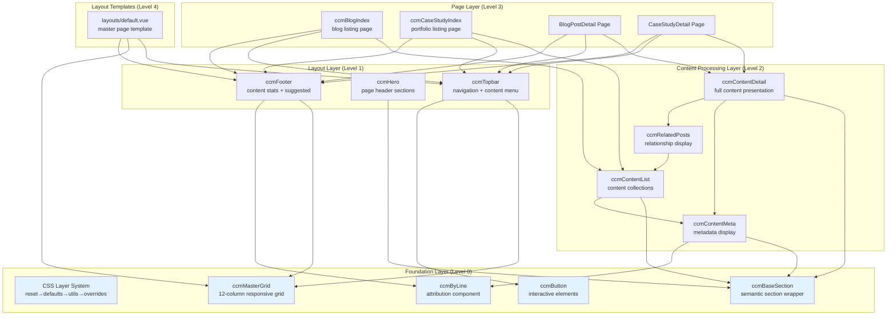

# Components

Based on the architectural patterns, tech stack, and data models, the major logical components across the fullstack system:

## ccmContentPipeline

**Responsibility:** Core content processing service that transforms markdown files into typed data structures during build time, handling all content queries, relationship computation, and metadata generation.

**Key Interfaces:**
- `processAllContent()`: Main entry point for content transformation during static generation
- `computeContentRelationships()`: Algorithm-based relationship detection between blog posts and case studies
- `generateContentMetadata()`: Build-time statistics and indexing information

**Dependencies:** Nuxt Content API, file system access, TypeScript interfaces

**Technology Stack:** Nuxt Content composables, Promise-based async processing, TypeScript for type safety

## ccmDataPiping

**Responsibility:** Component layer that receives processed content from pipeline and renders semantic HTML structure during static generation, serving as bridge between content processing and presentation.

**Key Interfaces:**
- `ccmContentMeta`: Renders rich metadata (brow, title, tagline, author, date) with semantic markup
- `ccmContentList`: Displays content collections with filtering and relationship highlighting
- `ccmContentDetail`: Full content presentation with embedded related content sections

**Dependencies:** ccmContentPipeline output, existing ccm component patterns, CSS layer system

**Technology Stack:** Vue 3 SFC components with Composition API, ccm naming conventions, CSS layer integration

## ccmRelationshipEngine

**Responsibility:** Intelligent content relationship detection and scoring system that analyzes content similarity, shared metadata, and cross-references to create meaningful content connections.

**Key Interfaces:**
- `computeTagSimilarity()`: Algorithm for matching blog posts to case studies via shared concepts
- `scoreRelationshipStrength()`: Weighted scoring system for relationship relevance ranking
- `generateCrossReferences()`: Bidirectional relationship mapping for content discovery

**Dependencies:** Data models (BlogPost, CaseStudy), content analysis algorithms, metadata processing

**Technology Stack:** TypeScript algorithms, build-time processing, content analysis utilities

## ccmStaticGenerator

**Responsibility:** Route generation and HTML creation system that produces all static pages, index routes, and content-specific URLs based on processed content structure.

**Key Interfaces:**
- `generateContentRoutes()`: Creates static routes for all blog posts and case studies
- `generateIndexPages()`: Produces listing pages with filtering and categorization
- `generateSitemapData()`: SEO-optimized site structure for search engines

**Dependencies:** Processed content data, Nuxt routing system, static generation pipeline

**Technology Stack:** Nuxt generate hooks, static route configuration, SEO optimization utilities

## ccmLayoutSystem

**Responsibility:** Existing layout and presentation layer enhanced with content piping capabilities, maintaining CSS layer architecture while adding content-specific rendering logic.

**Key Interfaces:**
- `ccmMasterGrid`: Enhanced grid system supporting dynamic content layouts
- `ccmTopbar`: Navigation integration with content-based menu generation
- `ccmFooter`: Content statistics and relationship-based suggested content

**Dependencies:** Existing ccm components, CSS layer system, processed content for dynamic elements

**Technology Stack:** Existing Vue 3 components, CSS layers (reset→defaults→utils→overrides), responsive grid system

## Frontend Component Hierarchy

**Component Dependency Tree and Reusability Patterns:**

**Component Reusability Matrix:**

| Component Level | Reusability | Dependencies | Usage Pattern |
|-----------------|-------------|---------------|---------------|
| **Foundation (Level 0)** | Highest | None | Used throughout system |
| • ccmMasterGrid | Universal | CSS layers | All layouts requiring grid structure |
| • ccmBaseSection | Universal | CSS layers | All semantic content sections |
| • ccmButton | Universal | CSS layers | All interactive elements |
| • ccmByLine | High | CSS layers | Author attribution across content types |
| **Layout (Level 1)** | High | Foundation | Page structure components |
| • ccmTopbar | Universal | Grid, Button | All pages requiring navigation |
| • ccmHero | High | BaseSection | Landing and feature pages |
| • ccmFooter | Universal | Grid, ByLine | All pages requiring footer |
| **Content (Level 2)** | Medium | Foundation + Layout | Content-specific components |
| • ccmContentMeta | High | BaseSection, ByLine | All content types needing metadata |
| • ccmContentList | High | BaseSection, Meta | All listing and index pages |
| • ccmContentDetail | Medium | BaseSection, Meta, Related | Individual content pages |
| • ccmRelatedPosts | Medium | ContentList | Content pages with relationships |
| **Page (Level 3)** | Low | All layers | Specific page implementations |
| • ccmBlogIndex | Single-use | List, Layout | Blog listing page only |
| • ccmCaseStudyIndex | Single-use | List, Layout | Case study portfolio only |
| • Page Templates | Single-use | Detail, Layout | Individual content pages |

**Shared Component Guidelines:**

**Foundation Components (Level 0):**
- **Never modify directly** - changes affect entire system
- **CSS layer integration required** - must work with existing layer system
- **Accessibility built-in** - semantic HTML and ARIA support
- **No content awareness** - purely presentational/structural

**Layout Components (Level 1):**
- **Content-aware** - can display dynamic navigation/footer content
- **Responsive by default** - work across all breakpoints
- **Can compose foundation** - build using Level 0 components
- **Theme consistent** - follow established visual patterns

**Content Components (Level 2):**
- **Type-aware** - understand BlogPost vs CaseStudy differences
- **Relationship-aware** - can display content connections
- **Build-time optimized** - receive processed data from composables
- **SEO optimized** - generate semantic markup for search engines

**Page Components (Level 3):**
- **Single responsibility** - one page type per component
- **Compose all layers** - integrate layout, content, and foundation
- **Route-specific** - tied to specific URL patterns
- **Static generation friendly** - work with Nuxt generate process

**Component Development Principles:**
1. **Dependency Direction**: Always depend on lower levels, never higher
2. **Prop Drilling Avoidance**: Use composables for complex data needs
3. **CSS Inheritance**: Leverage CSS layer system rather than component-specific styles
4. **TypeScript Contracts**: All props and events strictly typed
5. **Testing Isolation**: Each level testable independently
