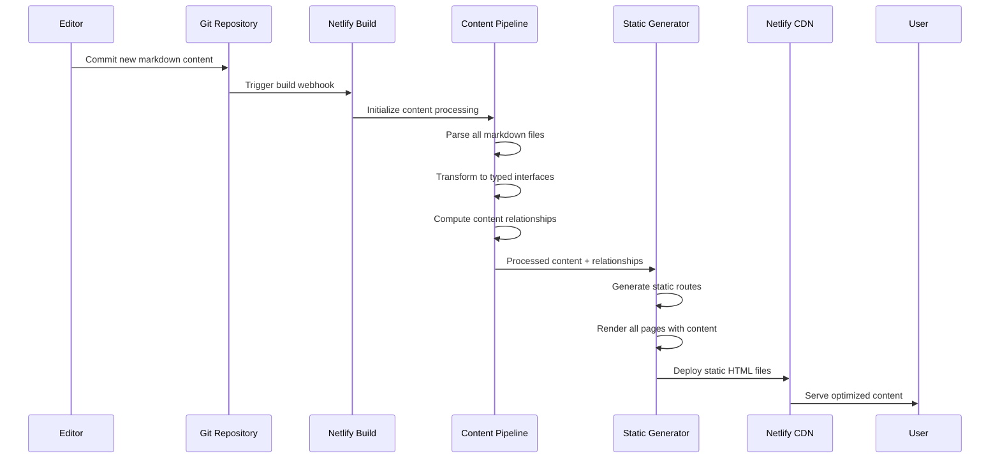
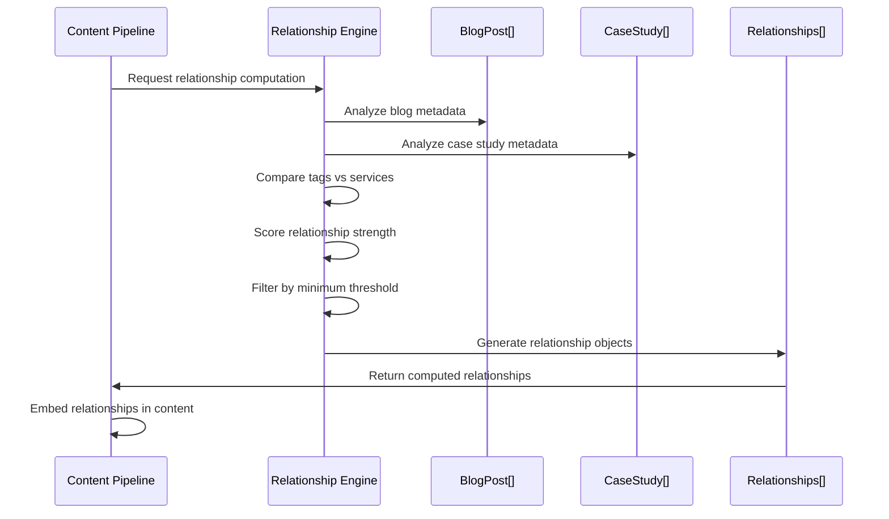
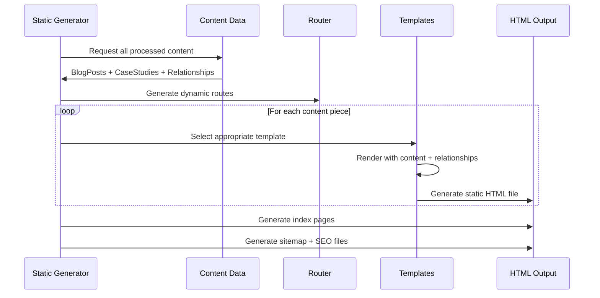
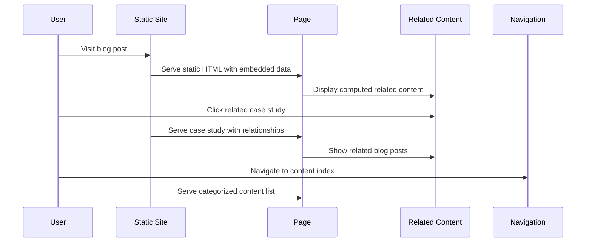
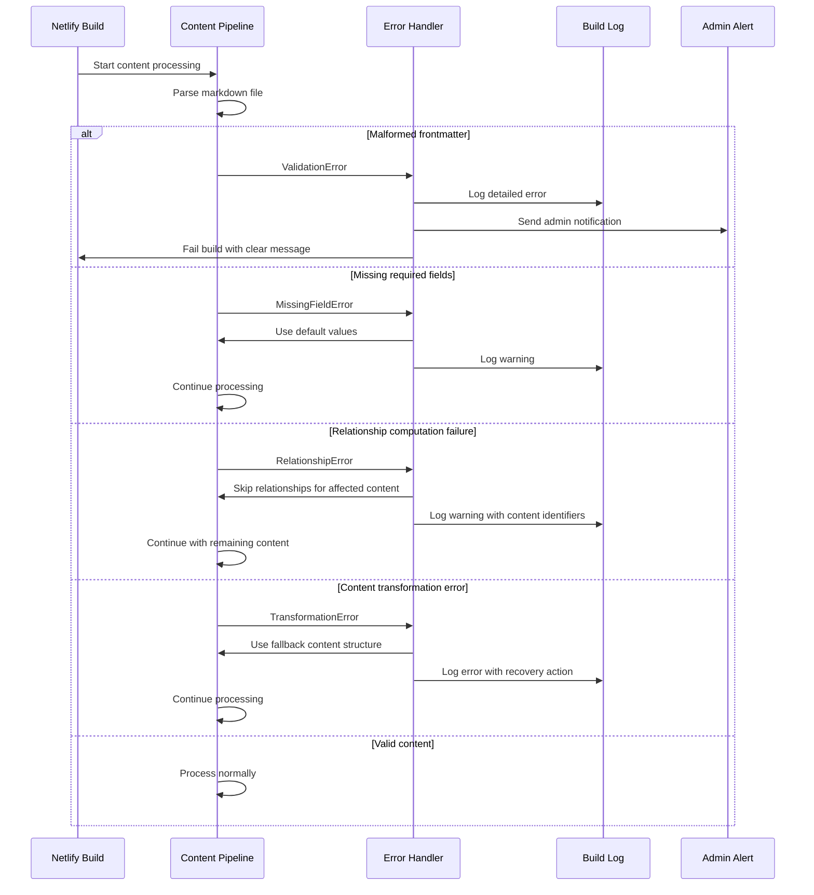

# Core Workflows

Key system workflows illustrating content processing, static generation, and user interactions:

## Content Publication Workflow



## Content Relationship Computation



## Static Page Generation Flow



## User Content Discovery Journey



## Build-Time Error Handling



## Content Processing Resilience Strategy

**Error Recovery Hierarchy:**
1. **Critical Errors** (Fail Build): Malformed project structure, missing required dependencies
2. **Content Errors** (Skip & Continue): Individual content piece processing failures
3. **Relationship Errors** (Degrade Gracefully): Relationship computation failures don't block content
4. **Validation Warnings** (Log & Continue): Missing optional metadata, formatting issues

**Specific Failure Scenarios:**

**Relationship Computation Failures:**
- **Scenario**: Algorithm fails to compute relationships for specific content pair
- **Recovery**: Skip affected relationships, continue processing remaining content
- **Logging**: Log content identifiers and relationship type that failed
- **User Impact**: Content still publishes, just without some related content suggestions

**Content Transformation Errors:**
- **Scenario**: Markdown processing fails for individual post/case study
- **Recovery**: Use fallback content structure with title/date only
- **Logging**: Log transformation error with specific content file path
- **User Impact**: Content publishes with minimal metadata instead of full rich data

**Build Performance Degradation:**
- **Scenario**: Relationship algorithms timeout with large content volumes
- **Recovery**: Implement timeout limits, fallback to simpler relationship scoring
- **Logging**: Performance metrics and timeout warnings
- **User Impact**: Reduced relationship accuracy but site still builds

**Content Validation Pipeline:**
```typescript
// Enhanced error handling in content pipeline
interface ContentProcessingResult {
  success: boolean;
  content?: ProcessedContent;
  errors: ContentError[];
  warnings: ContentWarning[];
}

interface ContentError {
  type: 'critical' | 'content' | 'relationship' | 'validation';
  source: string;
  message: string;
  recoveryAction: string;
}
```
