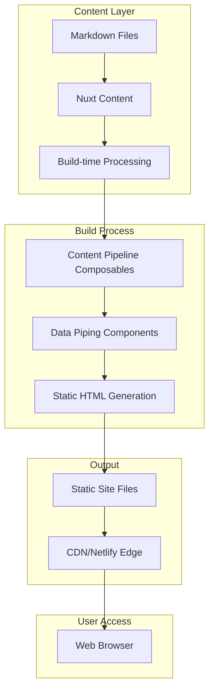

# High Level Architecture

## Technical Summary

The CCM Website employs a **Static Site Generation (SSG) architecture** built on Nuxt 3, transitioning from the current server-side rendering configuration to a fully pre-rendered static site. This architecture leverages **build-time content processing** where all Nuxt Content markdown files are transformed into static HTML during the `nuxt generate` process, with content relationships and metadata pre-computed and embedded directly in the generated markup.

The frontend utilizes **Vue 3 Composition API** with a sophisticated CSS layer system (reset→defaults→utils→overrides) and component-based architecture using ccm naming conventions. The backend processing occurs entirely at build time through Nuxt Content's static generation capabilities, eliminating runtime API calls and creating a deployment-ready static site optimized for CDN delivery.

Key integration occurs through **content piping components** that bridge raw Nuxt Content data with structured HTML output, enabling complex blog posts (15+ metadata fields), case studies, and content relationships to be processed into semantic static markup. The architecture prioritizes content-first design where editorial workflows drive technical implementation, supporting the transition from research communication to digital publication platform.

## Platform and Infrastructure Choice

**Platform:** Netlify + Nuxt 3 SSG
**Key Services:** Git-based deployment, build optimization, CDN edge network, form handling
**Deployment Host and Regions:** Global CDN with automatic SSL

**Platform Selection Rationale**: Netlify chosen for content-heavy static sites with Git-based workflows, excellent Nuxt 3 support, automatic builds on content changes, and strong academic/research organization user base.

## Repository Structure

**Structure:** Monorepo with clear content/code separation
**Monorepo Tool:** Not required (simple Nuxt 3 project structure sufficient)
**Package Organization:** Single package with organized directories for content pipeline

## High Level Architecture Diagram

## Architectural Patterns

- **Jamstack Architecture:** Static site generation with build-time content processing - _Rationale:_ Optimal performance and SEO for content-heavy academic/research website
- **Content-First Design:** Editorial workflows drive technical architecture - _Rationale:_ Content complexity (15+ metadata fields) requires architecture that serves editorial needs first
- **Component-Based UI:** Reusable ccm-prefixed Vue components with CSS layers - _Rationale:_ Maintains existing design system while enabling content piping functionality
- **Build-Time Data Processing:** All content queries and relationships resolved during generation - _Rationale:_ Eliminates runtime complexity and ensures perfect SEO/performance
- **Progressive Enhancement:** Static HTML foundation with optional JavaScript enhancements - _Rationale:_ Ensures content accessibility and fast loading across all devices and networks
